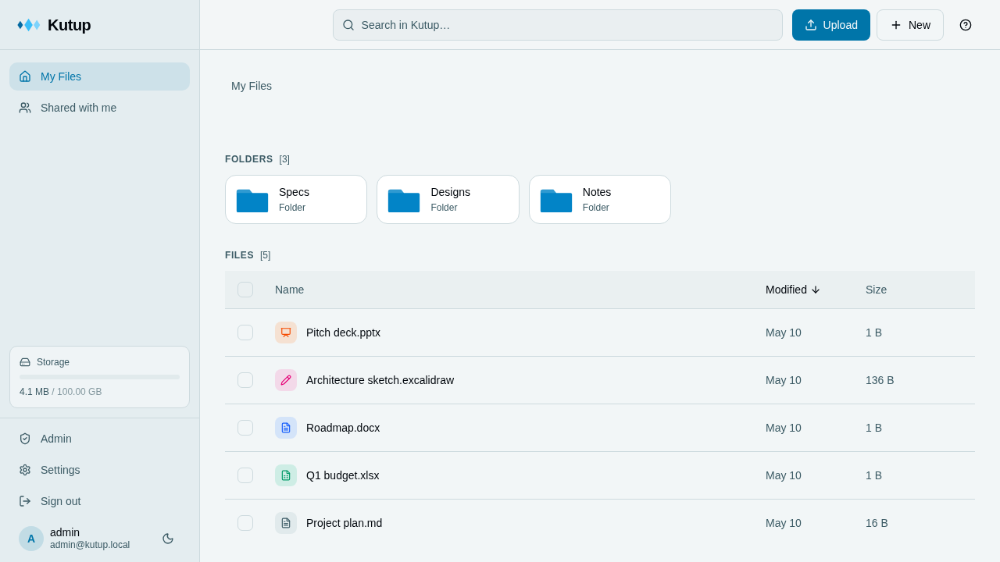
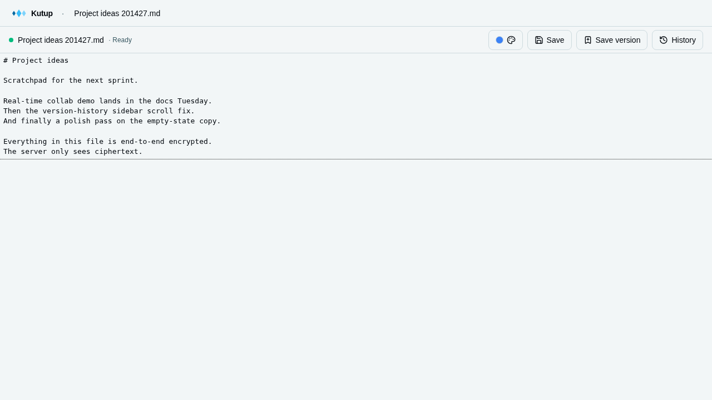
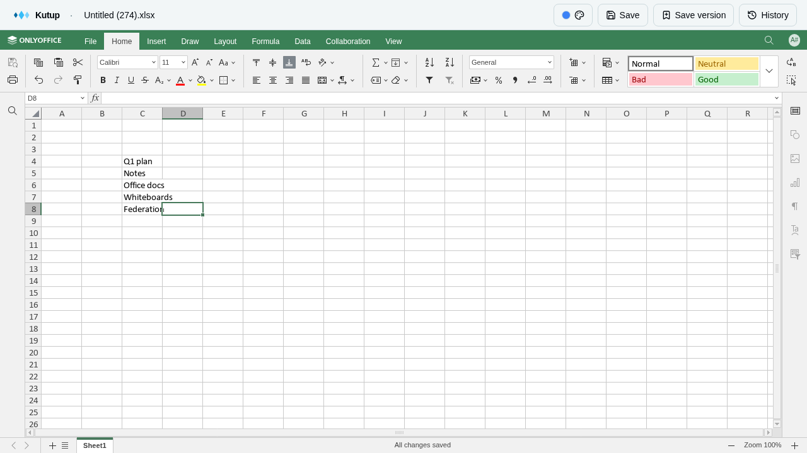
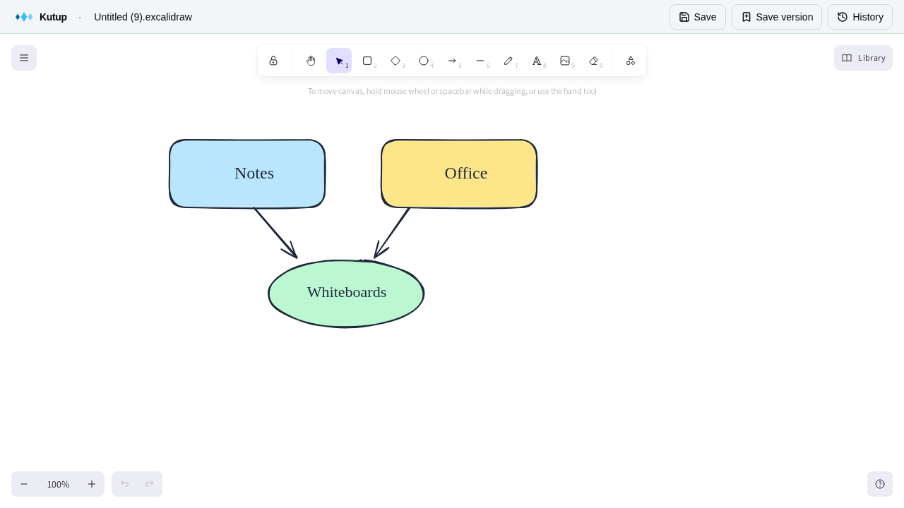
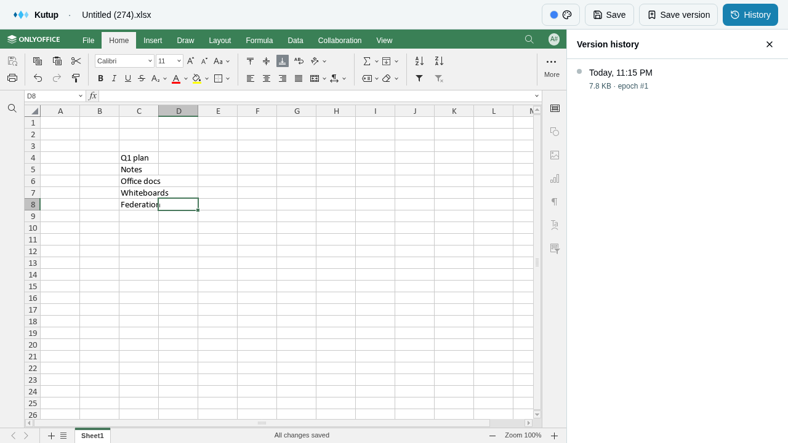
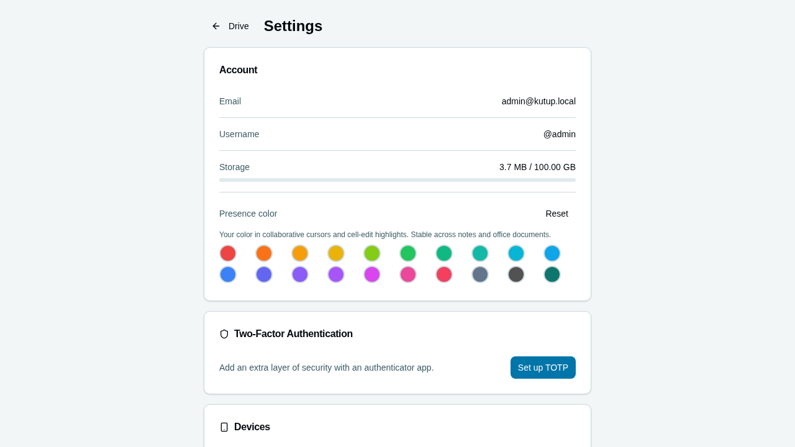
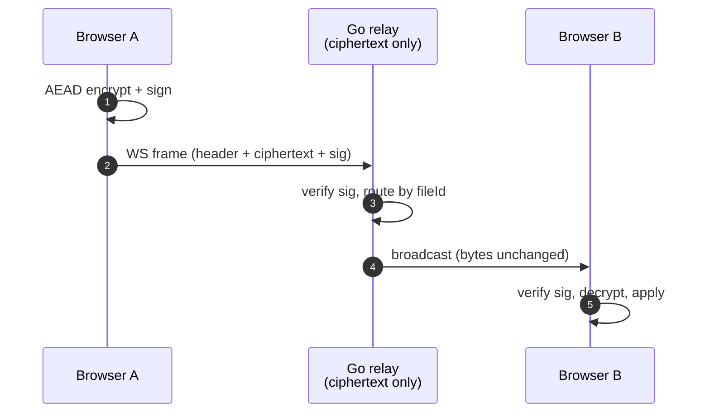

<div align="center">



# Kutup

**End-to-end encrypted, self-hosted Google Drive — with real-time collab for notes, office docs, and whiteboards.**


</div>

---

## What is Kutup?

Kutup is a privacy-first file storage and live-collaboration platform you run on your own hardware. **The server only ever sees ciphertext** — every file, filename, folder, document edit, and cursor position is encrypted in your browser before it leaves the page. Decryption keys live in your browser memory, derived from your password and a 24-word recovery phrase.

What makes it different from "encrypted Dropbox" clones is the second word in that sentence: **collaboration**. Notes, code, spreadsheets, slides, and whiteboards all sync in real time between peers without giving up the E2EE invariant. The relay sees a stream of opaque AEAD-encrypted, Ed25519-signed frames — it can route them, persist them, and deliver them to other tabs, but it can't read a single byte of content.

Self-hosted by design. Federation lets you share a folder with someone on a different Kutup server without trusting either backend with plaintext.

---

## Highlights

### Files & folders that the server can't read


Nested collections, drag-and-drop upload, public share links, per-user folder shares with read/upload/delete permissions, and a hard-baked encryption boundary. Filenames, MIME types, and folder structure are encrypted client-side. Stream upload via `crypto_secretstream_xchacha20poly1305` keeps large files out of memory. Storage backs onto SeaweedFS (S3-compatible).

### Live notes & code



CodeMirror 6 + Yjs CRDT for `.md`, `.txt`, and 20+ code formats (Go, TS, Rust, Python, C/C++, Java, Shell, …). Multi-user cursors, selection presence, awareness color picked by the user. Every edit is a Yjs binary update wrapped in an AEAD envelope — the server gets opaque ciphertext.

### Office docs — fully client-side



`.docx`, `.xlsx`, `.pptx` via [OnlyOffice](https://github.com/ONLYOFFICE), running entirely in the browser using the [CryptPad pattern](docs/onlyoffice.md). Document state is never decrypted server-side. Live cell-selection presence (peer ranges shown as translucent colored rectangles), per-user color, multi-tab differentiation, full conditional formatting, formulas, and charts.

### Whiteboards (Excalidraw)



`.excalidraw` files open in [Excalidraw](https://excalidraw.com/) with cross-tab sync. Last-write-wins per element via `versionNonce` + `reconcileElements`. Same E2EE envelope as everything else.

### Version history on every file



Every Save creates a versioned snapshot. Open the History sidebar in any editor, scroll back, restore. Named "Save version" entries are kept forever; anonymous saves age out (30 days OR 50 versions, whichever yields more). The endpoint is file-type-agnostic — notes, office, whiteboards all use the same plumbing.

### You own your keys



Multi-device with per-device Ed25519 keypairs (revocable individually). 24-word BIP39 recovery phrase that doubles as the second factor for account recovery. Optional TOTP 2FA. A picked presence color follows you across notes and office editors, on every tab.

---

## Quick Start

```sh
git clone https://github.com/kutupbulut/kutup.git
cd kutup
cp .env.example .env
# Edit .env — set strong values for POSTGRES_PASSWORD, JWT_SECRET,
# S3_SECRET_KEY, ADMIN_ACCOUNTS.
docker compose up -d --build
```

Open `http://localhost`, log in with the credentials from `ADMIN_ACCOUNTS`, save your generated recovery phrase, and you're in.

Optional: `./install-onlyoffice.sh` enables `.docx` / `.xlsx` / `.pptx` editing (otherwise office files are download-only).

---

## CLI

`kutup` is a Cobra-based CLI for the same E2EE primitives as the web — login, ls, upload, download, sync, share, versions, devices, 2fa, public-link consumption, file rename. All operations are end-to-end encrypted in your shell; the server only ever sees ciphertext.

**Install** (Go ≥ 1.22 + `$GOPATH/bin` on `$PATH`):

```sh
go install github.com/kutupbulut/kutup/cmd/kutup@latest
```

Or build from source:

```sh
git clone https://github.com/kutupbulut/kutup.git
cd kutup/cmd/kutup
go build -o ~/.local/bin/kutup .
```

Tagged release binaries (Linux / macOS / Windows; amd64 + arm64) are published via [goreleaser](cmd/kutup/.goreleaser.yaml) on GitHub Releases.

### Common workflows

```sh
# Login (interactive password + recovery phrase prompt for first device).
kutup login --server https://your.kutup.host

# List your folders + files at the Drive root.
kutup ls
kutup ls <folder-id>           # contents of a sub-folder

# Upload a file. The CLI's chunked stream encryption (5 MB blocks via
# crypto_secretstream) has NO browser-imposed size limit — multi-GB
# files (ISOs, raw video, datasets) work where the web upload chokes
# around ~2 GB and crashes the tab. File size is bounded by disk,
# not RAM.
kutup upload ./big-dataset.tar.gz <folder-id>
kutup upload ./local-dir <folder-id> --recursive

# Download a file. For collab-edited files (notes / office /
# whiteboards) returns the latest snapshot — same content the web
# shows, not the cold-start initial.
kutup download <file-id>
kutup download <file-id> ./local/path/

# Bidirectional sync. --watch keeps the local folder live-synced via
# fsnotify; new local files upload immediately, new remote files
# arrive within seconds.
kutup sync ./local-folder <folder-id>
kutup sync ./local-folder <folder-id> --watch

# Snapshot versions of any file (notes, office, whiteboard).
kutup versions list <file-id>
kutup versions restore <file-id> <version-id>

# Public-link consumption — no kutup login required for the URL itself.
kutup pub get https://your.kutup.host/p/<token>#key=<base64>
kutup pub download <url> <file-id>

# Discover the rest.
kutup --help
kutup version
```

The **>2 GB** path is the standout. Browser File API + Web Crypto streaming work in theory but practically wedge the tab at multi-GB sizes; the CLI uses `golang.org/x/crypto/chacha20poly1305` over Go's `io.Reader`, so it streams arbitrarily large files at constant ~5 MB memory.

---

## Architecture in 30 seconds

Every collab frame is encrypted in the browser, signed with a per-device Ed25519 key, and sent through an opaque WebSocket relay:



The relay can persist frames (`yjs_update`, `oo_op`, version blobs) but cannot decrypt them. Per-file content keys are derived deterministically from the collection master key — no key wrapping, no plaintext on the wire.

For the full picture (key hierarchy, login flow, federation model, storage layer, wire envelope spec): [docs/architecture.md](docs/architecture.md).

---

## Tech Stack

| Layer | Technology |
|-------|------------|
| Backend | Go 1.25, [Fiber v2](https://gofiber.io/) (HTTP + WebSocket), [pgx v5](https://github.com/jackc/pgx), PostgreSQL 16 |
| Frontend | React 18, TypeScript 5.4, Vite 8, [Redux Toolkit 2](https://redux-toolkit.js.org/), [TailwindCSS](https://tailwindcss.com/) + [Radix UI](https://www.radix-ui.com/) |
| Crypto | [libsodium-wrappers-sumo](https://github.com/jedisct1/libsodium.js) — Argon2id, XChaCha20-Poly1305 AEAD, Ed25519, NaCl box / secretbox / secretstream |
| Realtime collab | Yjs 13 + `y-codemirror.next` (notes); OnlyOffice + `x2t` WASM (office); `@excalidraw/excalidraw` (whiteboards); custom Go relay with per-frame AEAD envelopes |
| Storage | [SeaweedFS](https://github.com/seaweedfs/seaweedfs) (S3-compatible) |
| Infrastructure | Docker Compose, Nginx (TLS termination + static asset serving) |
| Testing | Playwright (e2e), Go `testing` (unit + integration), Vitest (frontend unit) |

---

## Documentation

| | |
|---|---|
| Self-hosting (TLS, backups, reverse proxies, env vars) | [docs/self-hosting.md](docs/self-hosting.md) |
| System architecture (key hierarchy, federation, collab wire) | [docs/architecture.md](docs/architecture.md) |
| OnlyOffice integration & CryptPad-pinned bundle | [docs/onlyoffice.md](docs/onlyoffice.md) |
| REST API reference | [docs/api.md](docs/api.md) |
| Local dev setup, code conventions, project structure | [docs/contributing.md](docs/contributing.md) |
| Interactive Swagger UI | `/swagger/index.html` on a running stack |

---

## Acknowledgements

Kutup's design and several of its core technical choices are directly inspired by — and in places adapted from — these projects:

- **[OnlyOffice](https://github.com/ONLYOFFICE)** — AGPL `documenteditor` / `spreadsheeteditor` / `presentationeditor` builds power kutup's collaborative office editing. The bridged iframe + `x2t` WASM converter approach is taken straight from upstream.
- **[CryptPad](https://github.com/cryptpad/cryptpad)** — the pattern of running OnlyOffice client-only with all document state encrypted in the browser is theirs. kutup's office collab follows their playbook (see [docs/onlyoffice.md](docs/onlyoffice.md)).
- **[Ente](https://github.com/ente-io/ente)** — the E2EE primitives (libsodium, the master/collection/file-key hierarchy, Argon2id-derived login keys, streaming chunk format) are modeled on Ente's open-source clients.
- **[Excalidraw](https://github.com/excalidraw/excalidraw)** — kutup's whiteboard editor embeds the upstream `@excalidraw/excalidraw` React component. The status-driven asset flow (`pending` → upload → `saved` → peer fetch on reconcile) and the `versionNonce`-based last-write-wins reconciliation come straight from upstream's collab model.

Where code, schemas, or protocol details were copied or closely adapted, the relevant files carry the upstream license headers.

---

## License

**AGPL-3.0-only** — Copyright (c) 2026 Alperen Albayrak. See [LICENSE](LICENSE).

The OnlyOffice subtree under `frontend/public/onlyoffice/` and the kutup ↔ OnlyOffice bridge in `frontend/src/components/editors/office/` are licensed AGPL-3.0-or-later (so they can link the OnlyOffice client). Full license boundary: [frontend/public/onlyoffice/LICENSE.md](frontend/public/onlyoffice/LICENSE.md).
