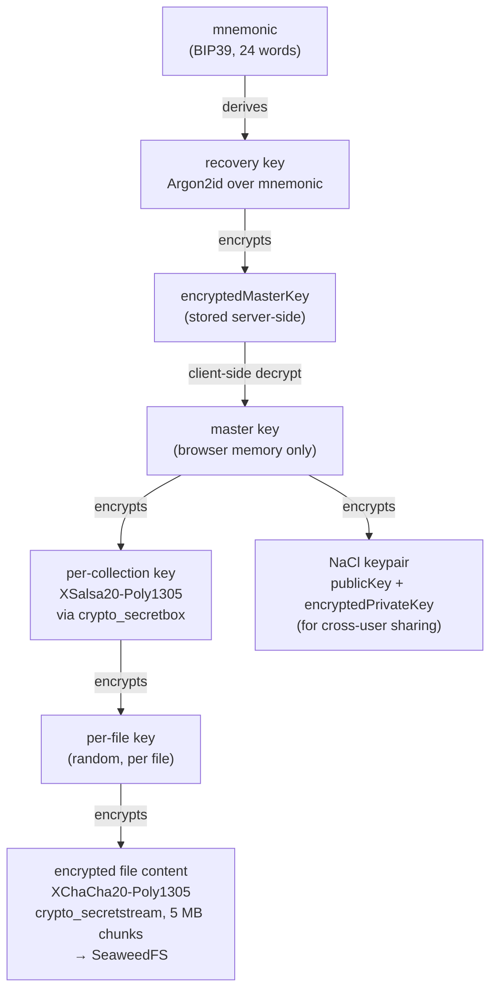
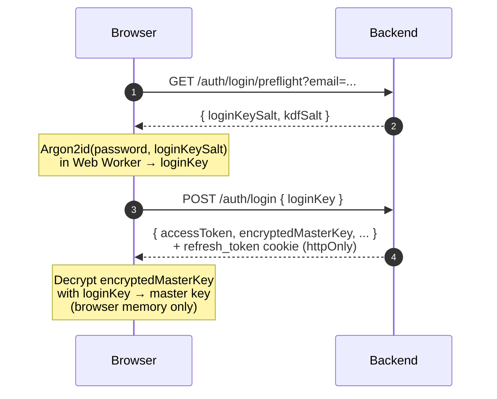
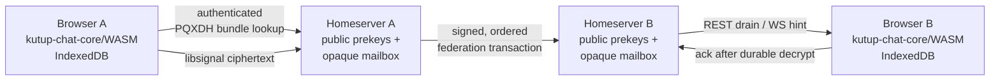
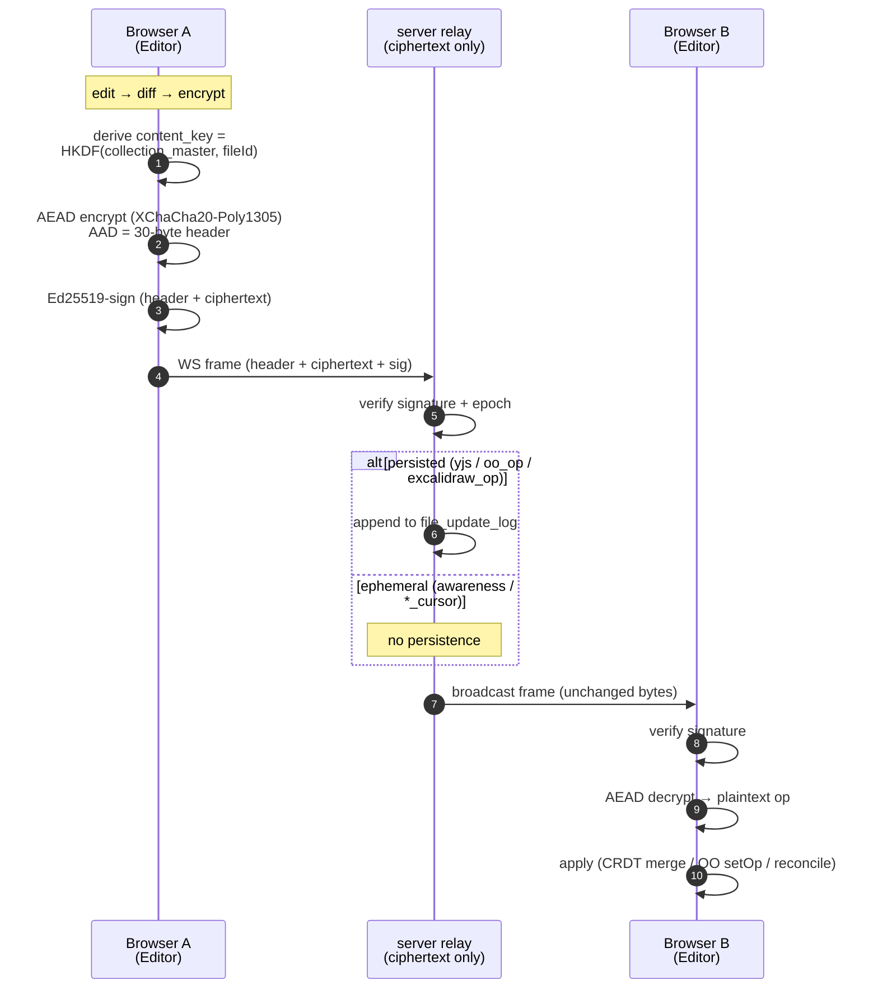

# Architecture

Kutup is a zero-knowledge file storage system. The server stores only ciphertext — it never sees plaintext file content, filenames, or cryptographic keys.

---

## Key Hierarchy



Every cryptographic primitive is from **libsodium** (`libsodium-wrappers-sumo`), running entirely in the browser. The backend is a pure ciphertext relay.

---

## Registration Flow

1. Client generates a random 32-byte **master key**.
2. Client derives a **login key** from the user's password using Argon2id (`loginKeySalt`). Only the base64-encoded `loginKey` is sent to the server, which then bcrypts it and stores `login_key_hash`. The raw password never leaves the browser.
3. Client generates a NaCl box **keypair** (`publicKey`, `privateKey`).
4. Client derives a **recovery key** from a freshly generated BIP39 mnemonic using Argon2id (`kdfSalt`).
5. Client encrypts:
   - `masterKey` with the recovery key → `encryptedRecoveryKey` + `recoveryKeyNonce`
   - `masterKey` with the login key → `encryptedMasterKey` + `masterKeyNonce`
   - `privateKey` with the master key → `encryptedPrivateKey` + `privateKeyNonce`
6. Client also sends a **recovery proof** — base64 of the recovery-key entropy. The server bcrypts it into `recovery_key_verifier` so it can later confirm the client really holds the mnemonic during account recovery (no plaintext recovery key is ever transmitted).
7. Client POSTs the encrypted bundle to `POST /api/auth/register`. The server stores all ciphertext, the public key, and the recovery verifier. The mnemonic is shown to the user once and never stored anywhere.

---

## Login Flow



1. Client fetches `GET /api/auth/login/preflight?email=...` to retrieve `loginKeySalt` and `kdfSalt`.
2. Client recomputes the login key from the password + `loginKeySalt` via Argon2id (in a Web Worker to avoid blocking the UI).
3. Client POSTs the base64 `loginKey` to `POST /api/auth/login`. Server bcrypt-compares it against the stored `login_key_hash`.
4. On success the server returns an **access token** (short-lived JWT) in the JSON body and sets the **refresh token** as an HTTP-only `refresh_token` cookie scoped to `/api/auth/refresh`.
5. The login response also carries `encryptedMasterKey` + `masterKeyNonce` (and the encrypted private key); the client decrypts the master key locally with the login key. The master key lives only in browser memory.
6. If 2FA is enabled, the server returns `{requiresTotp: true, preAuthToken: ...}` instead of full tokens. The client completes login at `POST /api/auth/login/2fa` with a TOTP code before receiving the full JWT.
7. For accounts created via `ADMIN_ACCOUNT` that have not yet generated a recovery phrase, the server returns `{requiresSetup: true, setupToken: ...}`. The client derives a fresh key bundle and submits it to `POST /api/auth/complete-setup`.

---

## File Encryption

For each file upload:

1. Client generates a random **file key**.
2. Client encrypts the file bytes with the file key → `encryptedFileContent`.
3. Client encrypts file metadata (name, size, MIME type) with the file key → `encryptedMetadata` + `metadataNonce`.
4. Client encrypts the file key with the **collection key** → `encryptedFileKey` + `fileKeyNonce`.
5. Client uploads the ciphertext blob and encrypted metadata as a multipart POST.
6. Backend stores the blob in SeaweedFS and records the encrypted metadata in PostgreSQL.

On download, the client receives the blob and all encrypted fields, then reverses the process locally.

---

## Collection Sharing

Sharing a collection with another user:

1. Sharer fetches the recipient's `publicKey` from `GET /api/users/by-email/:email`.
2. Sharer seals the **collection key** to the recipient's public key using NaCl crypto_box (sender-anonymous via sealed-box; recipient decrypts with their own private key alone).
3. Sharer POSTs the sealed collection key to `POST /api/collections/:id/share` along with the recipient's user ID and two boolean grants — `canUpload` and `canDelete`. Read access is implicit; an optional `uploadQuotaBytes` caps how much the recipient may upload to this share.
4. Recipient sees the shared collection on next list. They unseal the collection key using their own private key (decrypted from `encryptedPrivateKey` using their master key).

The server stores the encrypted collection key — it cannot read it.

---

## Federation Model

Federation allows sharing a collection with a user on a **different Kutup server**.

```
Server A (sharer)                          Server B (recipient)
─────────────────                          ────────────────────
1. Look up recipient's pubkey
   GET /api/fed/users?username=...
   on Server B
                                           ← returns publicKey

2. Encrypt collection key to pubkey
   POST /api/collections/:id/share-federated
   (creates a federated share token)

3. Return invite link:
   Server B URL + /accept?token=...
   + inviteToken (for Server A's API)

                                           4. Recipient opens invite link
                                              POST /api/fed-proxy/incoming
                                              (registers the share on Server B)

                                           5. Recipient browses via proxy:
                                              GET /api/fed-proxy/:shareId/files
                                              → Server B proxies to Server A
                                              GET /api/fed/shares/:token/files

                                           6. File downloads proxied similarly.
```

**SSRF protection:** Before proxying requests to the remote server URL, the backend validates that the target hostname is not a private/loopback address.

**Cross-server upload/delete** is gated by the `canUpload` and `canDelete` boolean grants set at share time.

---

## Federated E2EE Chat ("ileti")

Chat is a separate cryptographic subsystem from drive encryption and
collaborative editing. It uses the shared Rust `kutup-chat-core` engine in the
browser through WebAssembly; Android and iOS will consume the same engine
through UniFFI after the web protocol and feature set are complete. The
normative contract is [`chat-protocol.md`](chat-protocol.md).



### Client and server responsibilities

- Each chat device has an independent libsignal identity and publishes signed
  prekeys plus one-time classical and post-quantum prekeys. New sessions use
  PQXDH; established sessions use libsignal's Triple Ratchet construction.
- A logical send encrypts separately to every active recipient device. A
  server-side device-set mismatch rejects the entire send, causing the client
  to refresh the signed directory and re-encrypt instead of silently skipping
  a device.
- The client persists ratchets, plaintext history, pending ciphertext,
  message-request state, encrypted-profile capabilities, and transparency
  trust in an account-scoped IndexedDB database. Web Locks serialize ratchet
  transactions across tabs. Ciphertext is durably journaled before decrypt and
  acknowledged only after the ratchet advance and plaintext commit together.
- The server stores public directory material and opaque per-device mailbox
  ciphertext. REST drain/ack is the source of truth; a one-use-ticket WebSocket
  is only a low-latency reconciliation hint. Client-generated `sendId` values
  make retries idempotent.
- Note to Self is a self-addressed direct conversation. On multi-device
  accounts, encrypted sent transcripts synchronize messages to the sender's
  other devices; a one-device note remains local without creating a fake
  one-member group.

### Identity, contacts, and profiles

The stable chat address is `username@server`; no alias namespace exists.
Changeable, non-unique display names and avatars are encrypted profile data and
never routing identities. Profile keys are capability-distributed inside E2EE
messages. Incoming strangers begin as durable message requests. Accept,
reject, block, and unblock are client-held relationship state; blocking also
rotates the local encrypted-profile capability so the blocked peer cannot read
future profile versions.

Blocking is not sealed sender: the current mailbox and federation servers can
still see sender and recipient addresses. A complete sealed-sender feature must
ship together with its delivery-capability abuse gate rather than merely
hiding a DTO field.

### Device-directory trust and transparency

An account self-authority key signs the exact chat-device manifest. Every
accepted manifest version is appended to a chronological Merkle log and the
current account value is authenticated by a sparse Merkle map. Exact
checkpoints carry a persistent operator signature and may carry signatures
from independently deployed witnesses; clients enforce their pinned operator
and witness-quorum policy.

The web client independently checks its local checkpoint when chat opens,
connectivity returns, the page becomes visible, the WebSocket reconnects, and
every 15 minutes while visible. Network unavailability is recorded as an
availability warning without discarding established trust. A signature,
consistency, rollback, policy, or witness-quorum failure is durable and blocks
creation of new sends until a later valid checkpoint recovers the state.
Existing durable ciphertext is retained.

### Transport-only federation

Federation uses canonical DNS server names, `.well-known` delegation, and
destination/body-bound Ed25519 request signatures. Outbound transactions are
persisted and strictly ordered per destination; receivers atomically commit
mailbox rows, replay records, and a contiguous sequence high-water mark.
Neither homeserver replicates conversation or room state.

Federation is disabled unless the administrator configures a persistent
signing key. Once enabled, the current implementation accepts any correctly
authenticated public Kutup peer that passes HTTPS, DNS/SSRF, protocol, payload,
and rate-limit checks. There is not yet an administrator-managed server
allowlist/blocklist or pinned remote-key rotation policy; these are explicit
hardening work, not properties operators should assume already exist.

### Current product boundary

The web client currently supports direct text messaging, linked-device sync,
Note to Self, transport federation, message requests/blocking, encrypted
profiles, signed device manifests, and monitored key transparency. Private
groups, attachments/media, receipts, typing, disappearing messages, sealed
sender, calls, push delivery, and native-client integration remain future
slices tracked in [`roadmap.md`](roadmap.md).

---

## Storage Layer

Files are stored in **SeaweedFS** accessed via its S3-compatible API. The backend uses the Rust `aws-sdk-s3` crate configured to point at the internal SeaweedFS S3 gateway.

- The backend acts as a **streaming proxy** — multipart uploads are spooled to a temp file and streamed to SeaweedFS; the tus.io path uploads ≥5 MiB S3 multipart chunks, so neither buffers the whole file in memory.
- Each file is stored under a UUID key; the human-readable name exists only in `encryptedMetadata` which the server cannot read.
- The SeaweedFS cluster (master + volume + filer + S3 gateway) runs as Docker services on the same network as the backend. No S3 ports are exposed externally.
- Storage quotas are enforced by the backend before accepting uploads; the current usage is tracked in PostgreSQL.

---

## Database

PostgreSQL 16 is used for all persistent metadata:

- User accounts, key bundles, public keys
- Collection records and sharing permissions
- File records (encrypted metadata, SeaweedFS object keys)
- Public share tokens
- Federation share tokens and incoming shares
- Chat devices and public prekey pools
- Opaque per-device chat mailboxes and idempotent send records
- Signed device manifests, transparency log/map nodes, checkpoints, and witness attestations
- Durable per-destination federation outboxes and inbound replay/high-water records
- TOTP secrets (encrypted)
- Global settings and per-user quotas

Migrations live in `crates/kutup-server/migrations/` (sqlx's reversible `.up/.down.sql` format), are embedded into the server binary at compile time via `sqlx::migrate!()`, and run automatically on startup.

## Collaborative Editing

kutup supports real-time, end-to-end-encrypted collaborative editing for three file families:

| Family | Extensions | Engine |
|---|---|---|
| Notes / code | `.md`, `.txt`, `.js`, `.ts`, `.go`, `.py`, `.cpp`, `.rs`, … | Yjs CRDT (`Y.Text`) under CodeMirror 6 with `y-codemirror.next` |
| Office | `.docx`, `.xlsx`, `.pptx` | OnlyOffice client-side via the CryptPad pattern (`OO_OP` envelope kind wraps OnlyOffice's native ops; see [`docs/onlyoffice.md`](onlyoffice.md)) |
| Whiteboards | `.excalidraw` | Excalidraw with last-write-wins per element via `versionNonce` + `reconcileElements` |

The architecture is summarised below; the design rationale and footguns live in `docs/superpowers/specs/2026-05-04-collab-edit-design.md`.



### Sync engine
Three engines run side-by-side, each routed by `KIND` byte in the envelope:
- **Yjs CRDT** (`KIND.YJS_UPDATE` = 1) for notes/code. Clients exchange opaque binary update frames; the server never instantiates a `Y.Doc`.
- **OnlyOffice op** (`KIND.OO_OP` = 4) wraps the editor's native operation stream. Keeps document state consistent across peers using OO's own coauthoring protocol — patched to run client-side per [`docs/onlyoffice.md`](onlyoffice.md).
- **Excalidraw op** (`KIND.EXCALIDRAW_OP` = 8) carries an array of changed elements. Convergence relies on each element's `versionNonce` plus Excalidraw's `reconcileElements` — last-write-wins per element, no CRDT semantics. Ephemeral on the wire (canonical state lives in snapshots).

### Wire envelope
Each frame is wrapped in an XChaCha20-Poly1305 AEAD with `(version, kind, doc_key_id, sender_device_id, sequence)` as additional authenticated data, then signed with the sender's Ed25519 device key. The server validates the signature and stores the opaque ciphertext.

### Per-file content key
Derived deterministically as `HKDF-SHA256(collection_master_key, "kutup/file-content/v1", utf8(fileId))`. No new key wrapping — the existing collection-key plumbing already distributes the master key to authorized members.

### Device keys
Each browser tab session and each CLI session generates a fresh Ed25519 keypair. The public key is registered to the user account; the private key never leaves the device. Revocation marks the device inactive and forces existing WebSocket connections to close.

### Versioning
Two-tier:
- **Live deltas** in Postgres `file_update_log` (truncated on snapshot).
- **Snapshots** as SeaweedFS S3 noncurrent versions, indexed in `file_versions`.

Snapshots fire on idle 30s + ≥1 update, every 200 updates, or on explicit "Save version".

Retention: 30 days OR last 50 versions, whichever yields more. Named/keep-forever versions are exempt forever.

The snapshot endpoints (`/files/:fileId/snapshot-blob` + `/files/:fileId/versions`) are file-type-agnostic — notes, office docs, and whiteboards all use the same plumbing. Restore for blob-based editors (office, whiteboard) reposts the chosen old bytes as a new version then reloads the page; for Yjs editors the CRDT merges the restored state in-place.

### Federation, sharing
Existing collection-share + federation flows are unchanged. A live-edited file is still a regular `files` row with an encrypted blob; non-editing users continue to download it as today.

### Replay protection
Each frame carries a per-device monotonically-increasing sequence number. The `file_update_log` has a `UNIQUE (file_id, sender_device, sender_seq)` constraint that rejects replays at the database level. Combined with Ed25519 signature verification on every frame, this prevents both forgery and replay attacks.

### File editor route + cross-tab session
Editable files open at `/file/:cid/:fid` in a new browser tab via `window.open`. The route mounts `FileEditorPage`, which decrypts the collection key (owner: secretbox via masterKey; shared: sealed-box via privateKey), then the per-file key + metadata, then mounts `TextCollabEditor` full height.

Sensitive material is held tab-locally (Redux + `sessionStorage`). To avoid forcing a fresh login when a new editor tab opens, an already-authenticated tab broadcasts its session payload over a same-origin `BroadcastChannel('kutup-session')`. The fresh tab requests the session on boot (500 ms timeout); on hit it dispatches `setAuth`, on miss it redirects to `/login?next=<path>`. Logout is also broadcast — every tab signs out together so a sibling tab can't re-hydrate a fresh tab after sign-out. See `frontend/src/lib/sessionSync.ts`.
