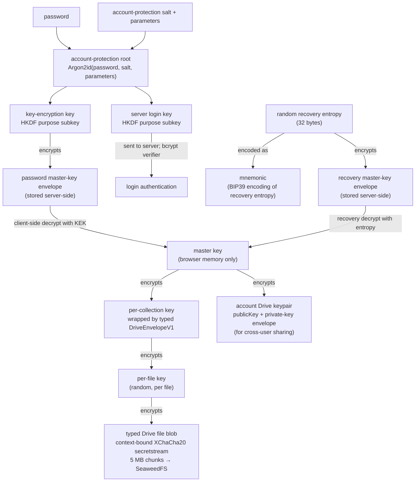
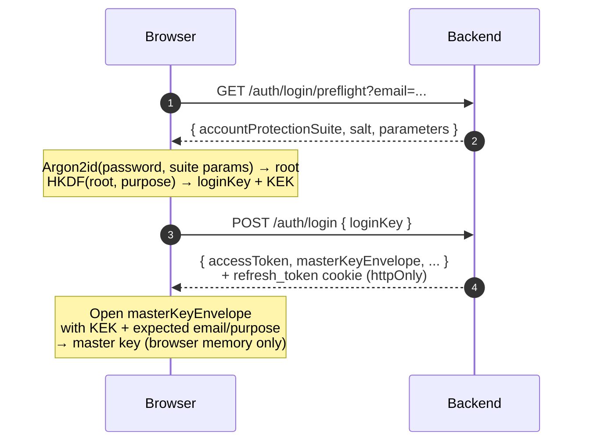
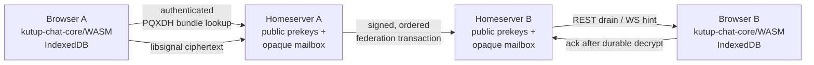
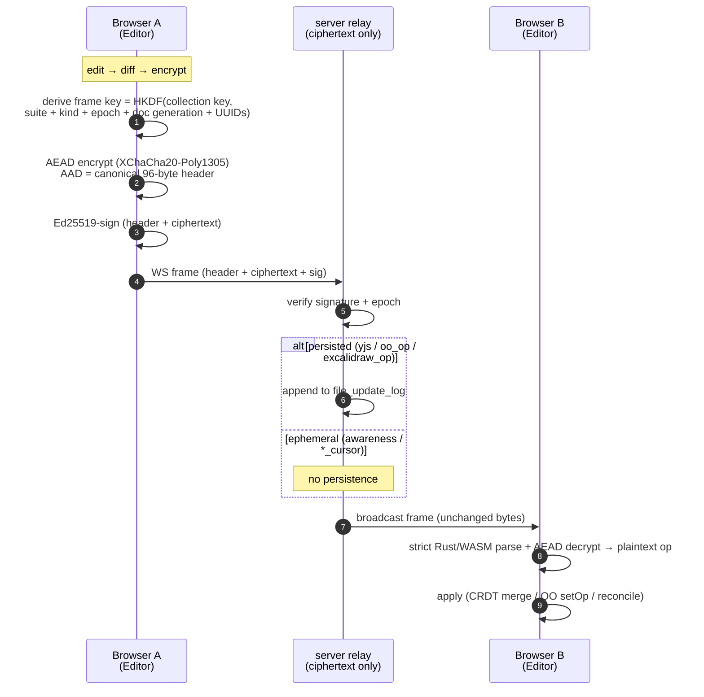

# Architecture

Kutup is a zero-knowledge file storage system. The server stores only ciphertext — it never sees plaintext file content, filenames, or cryptographic keys.

Kutup-owned cryptographic protocols follow the purpose-specific suite,
authenticated-capability, policy-floor, suite-locking, and explicit-migration
rules in [`crypto-agility.md`](crypto-agility.md). That decision is authoritative
for protocol evolution. This document describes the V1 target; unfinished
pre-tag cutovers are listed explicitly in [`roadmap.md`](roadmap.md) and must
not be advertised as complete.

Chat and Drive federation share the versioned identity, discovery, and HTTP
authentication boundary specified in
[`federation-protocol.md`](federation-protocol.md). Its pure v2 protocol and
identity/trust/policy persistence are implemented and both feature protocols
are cut over. No mixed v1/v2 trust path or raw remote URL remains.

---

## Key Hierarchy


```mermaid
flowchart TD
    P["password"]
    APS["account-protection salt + parameters"]
    APR["account-protection root<br/>Argon2id(password, salt, parameters)"]
    KEK["key-encryption key<br/>HKDF purpose subkey"]
    LK["server login key<br/>HKDF purpose subkey"]
    RE["random recovery entropy<br/>(32 bytes)"]
    M["mnemonic<br/>(BIP39 encoding of recovery entropy)"]
    EMK["password master-key envelope<br/>(stored server-side)"]
    ERK["recovery master-key envelope<br/>(stored server-side)"]
    MK["master key<br/>(browser memory only)"]
    CK["per-collection key<br/>wrapped by typed DriveEnvelopeV1"]
    DRIVE["account Drive keypair<br/>publicKey + private-key envelope<br/>(for cross-user sharing)"]
    FK["per-file key<br/>(random, per file)"]
    BLOB["typed Drive file blob<br/>context-bound XChaCha20 secretstream<br/>5 MB chunks → SeaweedFS"]

    P --> APR
    APS --> APR
    APR --> KEK
    APR --> LK
    LK -->|sent to server; bcrypt verifier| AUTH["login authentication"]
    RE -->|encoded as| M
    KEK -->|encrypts| EMK
    RE -->|encrypts| ERK
    EMK -->|client-side decrypt with KEK| MK
    ERK -->|recovery decrypt with entropy| MK
    MK -->|encrypts| CK
    MK -->|encrypts| DRIVE
    CK -->|encrypts| FK
    FK -->|encrypts| BLOB
```

The canonical implementation is `kutup-crypto` (`dryoc` plus RustCrypto). The
browser consumes it through WASM; CLI and native clients call the same Rust
implementation. A primitive-only browser adapter is allowed solely under the
10×/platform-failure exception in
[`cryptographic-dependencies.md`](cryptographic-dependencies.md). The backend
remains a ciphertext relay.

---

## Registration Flow

1. Client generates a random 32-byte **master key**.
2. Client derives one account-protection root with the persisted suite,
   Argon2id salt and parameters. Domain-separated HKDF expands that root into a
   **key-encryption key** and a **login key**. Only the base64-encoded login key
   is sent to the server, which bcrypts it into `login_key_hash`. The password,
   root and key-encryption key never leave the client.
3. Client derives the account authority, incarnation, Drive X25519 keypair and
   Drive Ed25519 share-signing key from the master key under independent fixed
   HKDF labels. Their public values are bound to the account at registration
   and later published unchanged in the signed account manifest; private keys
   are never sent in plaintext.
4. Client generates 32 random bytes of **recovery entropy** and encodes those
   exact bytes as a 24-word BIP39 mnemonic. BIP39 is an encoding here; the
   recovery path does not run Argon2id.
5. The canonical Rust implementation creates three XChaCha20-Poly1305
   `AccountEnvelopeV1` values:
   - `masterKey` under the key-encryption key with purpose `PasswordMasterKey`;
   - `masterKey` under the recovery entropy with purpose `RecoveryMasterKey`;
   - the Drive private key under the master key with purpose
     `DriveHpkePrivateKey`.
   Each single envelope carries and authenticates its closed suite ID, typed
   purpose, canonical lowercase login email, 24-byte nonce and exact ciphertext
   length. Separate nonce columns and implicit account-wrap formats do not
   exist in V1.
6. Client also derives a **recovery authorization proof** with HKDF-SHA256 from
   the recovery entropy, the fixed purpose
   `kutup/account-recovery/auth-proof/v1`, and the canonical lowercase login
   email.
   The server bcrypts only that proof into `recovery_key_verifier`. The proof is
   password-equivalent for recovery authorization, but cannot decrypt
   `recoveryKeyEnvelope`; the raw recovery entropy never leaves the client.
7. Client POSTs the encrypted bundle to `POST /api/auth/register`. The server
   stores all ciphertext, the complete public account-identity binding, and the
   recovery verifier. The mnemonic is shown to the user once and never stored
   anywhere. Every later account manifest must match the registered authority,
   incarnation, Drive encryption key and Drive signing key exactly.

---

## Login Flow


```mermaid
sequenceDiagram
    autonumber
    participant B as Browser
    participant S as Backend

    B->>S: GET /auth/login/preflight?email=...
    S-->>B: { accountProtectionSuite, salt, parameters }
    Note over B: Argon2id(password, suite params) → root<br/>HKDF(root, purpose) → loginKey + KEK
    B->>S: POST /auth/login { loginKey }
    S-->>B: { accessToken, masterKeyEnvelope, ... }<br/>+ refresh_token cookie (httpOnly)
    Note over B: Open masterKeyEnvelope<br/>with KEK + expected email/purpose<br/>→ master key (browser memory only)
```

1. Client fetches `GET /api/auth/login/preflight?email=...` to retrieve the
   account-protection suite, salt and complete Argon2id parameters.
2. Client recomputes one root via Argon2id in a Web Worker, then derives the
   login key and key-encryption key with distinct fixed HKDF purposes.
3. Client POSTs the base64 `loginKey` to `POST /api/auth/login`. Server bcrypt-compares it against the stored `login_key_hash`.
4. On success the server returns an **access token** (short-lived JWT) in the JSON body and sets the **refresh token** as an HTTP-only `refresh_token` cookie scoped to `/api/auth/refresh`.
5. The login response carries `masterKeyEnvelope` and
   `drivePrivateKeyEnvelope`; the client opens them locally with the expected
   account and purpose bindings. The server-facing login key cannot decrypt
   either. The master key lives only in client memory.
6. If 2FA is enabled, the server returns `{requiresTotp: true, preAuthToken: ...}` instead of full tokens. The client completes login at `POST /api/auth/login/2fa` with a TOTP code before receiving the full JWT.
7. For accounts created via `ADMIN_ACCOUNT` that have not yet generated a recovery phrase, the server returns `{requiresSetup: true, setupToken: ...}`. The client derives a fresh key bundle and submits it to `POST /api/auth/complete-setup`.

---

## File Encryption

For each file upload:

1. Client generates the canonical file UUID and random **file key** before contacting the server.
2. Client constructs a 48-byte `DriveFileBlobHeaderV1` containing magic,
   `DriveObjectSuiteId`, file-blob purpose, collection epoch, file UUID and
   collection UUID. HKDF-SHA256 derives a stream key from the random file key
   and that exact header.
3. Client encrypts the bytes in 5 MiB XChaCha20 secretstream frames. The Drive
   header is associated data on every frame, and even an empty object emits an
   authenticated `TAG_FINAL` frame. The stored prefix is the 48-byte Drive
   header followed by the 24-byte secretstream header.
4. Client seals `{name, mimeType, size}` as a `FileMetadata`
   `DriveEnvelopeV1` under the file key. Its authenticated context binds the
   file UUID, collection UUID, collection-key epoch, and metadata revision.
5. Client seals the file key as a `FileKey` `DriveEnvelopeV1` under the
   collection key, bound to the same UUIDs and epoch.
6. Client uploads the UUID, two canonical envelopes, and opaque content. The
   backend independently checks all three public headers against the current
   collection epoch before storage. Multipart, tus, version snapshots and
   signed federation use identical blob semantics.
7. Rename creates the exact next metadata revision; rollback, gaps, relocation,
   wrong purpose, stale epoch, stream truncation and bytes after `TAG_FINAL`
   fail closed.

On download, the client receives the blob and all encrypted fields, then reverses the process locally.

---

## Collection Sharing

Sharing a collection with another user uses the recipient's account-manifest-bound
Drive HPKE key and the owner's manifest-bound Drive signing key. A
`NamedShareEnvelopeV1` authenticates the owner, recipient, collection, epoch,
canonical accounts, and both account incarnations. Local and federated sharing
use the same cryptographic envelope; federation adds only signed routing and a
domain-bound delivery capability. The server stores the envelope but cannot
open the collection key.

Public links use the same typed envelope implementation with the distinct
`PublicLinkCollectionKey` purpose. The random link key stays exclusively in
the URL fragment. The server validates the envelope's public header against
the owned collection, owner account and current epoch before storing it, but
cannot open it. A V1 public link targets one collection; it is never treated as
a named-user or federated identity grant.

---

## Federation Model

Federation allows sharing a collection with a user on a **different Kutup
server**. Drive and Chat are feature adapters over one server identity,
discovery, peer pin, admission policy, replay store, and signed transport.
Drive's capability grants access to one encrypted share; it does not replace
server authentication.

```
Server A (sharer)                          Server B (recipient)
─────────────────                          ────────────────────
1. Resolve and pin b.example
   via signed v2 discovery

2. Signed Drive directory lookup
   GET /api/fed/drive/users/bob
                                           ← signed bob@b.example publicKey

3. Browser seals collection key to Bob
   POST /api/collections/:id/federated-shares
   (stores canonical b.example + capability hash)

4. Return /invite#server=a.example&capability=...
   (fragment keeps capability out of HTTP requests/logs)

                                           5. Recipient opens invite link
                                              POST /api/drive/federation/shares
                                              Server B fetches signed invite
                                              and checks intended username

                                           6. Recipient browses local proxy API
                                              Server B sends signed drive.v1
                                              requests plus the separate share
                                              capability to Server A

                                           7. Download is spooled and its signed
                                              ciphertext digest verified before
                                              bytes reach the browser.
```

Production federation accepts canonical DNS identities and public HTTPS only.
The shared resolver verifies signed endpoint delegation, pins the peer
identity, resolves and connects to the already-validated address set, disables
redirects, and rejects private/loopback/link-local destinations. Plain HTTP and
private networks are available only to the explicit isolated test harness.

**Cross-server upload/delete** is gated by the `canUpload` and `canDelete`
grants. Mutations are idempotent under stable request IDs; changing the signed
content under an existing ID is rejected.

---

## Federated E2EE Chat ("ileti")

Chat is a separate cryptographic subsystem from drive encryption and
collaborative editing. It uses the shared Rust `kutup-chat-core` engine in the
browser through WebAssembly; Android and iOS will consume the same engine
through UniFFI after the web protocol and feature set are complete. The
normative contract is [`chat-protocol.md`](chat-protocol.md).


```mermaid
flowchart LR
    A["Browser A<br/>kutup-chat-core/WASM<br/>IndexedDB"]
    HA["Homeserver A<br/>public prekeys +<br/>opaque mailbox"]
    HB["Homeserver B<br/>public prekeys +<br/>opaque mailbox"]
    B["Browser B<br/>kutup-chat-core/WASM<br/>IndexedDB"]

    A -->|"authenticated<br/>PQXDH bundle lookup"| HA
    A -->|"libsignal ciphertext"| HA
    HA -->|"signed, ordered<br/>federation transaction"| HB
    HB -->|"REST drain / WS hint"| B
    B -->|"ack after durable decrypt"| HB
```

### Client and server responsibilities

- Each chat device has an independent libsignal identity and publishes signed
  prekeys plus one-time classical and post-quantum prekeys. New sessions use
  PQXDH; established sessions use libsignal's Triple Ratchet construction.
- A logical send encrypts separately to every active recipient device. A
  server-side device-set mismatch rejects the entire send, causing the client
  to refresh the signed directory and re-encrypt instead of silently skipping
  a device.
- The client persists ratchets, plaintext history, pending ciphertext,
  message-request state, encrypted-profile capabilities, and account-identity
  pins in an account-scoped IndexedDB database. Web Locks serialize ratchet
  transactions across tabs. Ciphertext is durably journaled before decrypt and
  acknowledged only after the ratchet advance and plaintext commit together.
- The server stores public directory material and opaque per-device mailbox
  ciphertext. REST drain/ack is the source of truth; a one-use-ticket WebSocket
  is only a low-latency reconciliation hint. Client-generated `sendId` values
  make retries idempotent.
- Note to Self is a self-addressed direct conversation. On multi-device
  accounts, encrypted sent transcripts synchronize messages to the sender's
  other devices; a one-device note remains local without creating a fake
  one-member group.

### Identity, contacts, and profiles

The stable chat address is `username@server`; no alias namespace exists.
Changeable, non-unique display names and avatars are encrypted profile data and
never routing identities. Profile keys are capability-distributed inside E2EE
messages. Incoming strangers begin as durable message requests. Accept,
reject, block, and unblock are client-held relationship state; blocking also
rotates the local encrypted-profile capability so the blocked peer cannot read
future profile versions.

Encrypted profile fields use `ProfileSuiteId = 1` and canonical
`ProfileEnvelopeV1` XChaCha envelopes. HKDF separates display-name, avatar and
master-key-wrapped profile-key purposes; the authenticated context binds the
canonical owner, version, revision and source device. The encrypted E2EE
profile-key capability carries the matching suite code, so a future or missing
suite cannot be silently interpreted as V1.

Accepted contacts use sealed sender when both servers advertise a complete
authenticated service policy. The destination receives only an origin domain,
recipient, capability, send id, and opaque per-device envelopes; mailbox rows
do not contain the sender. First contact, Note to Self, and linked-device sync
remain identified. Blocking rotates the profile key and delivery capability
before redistributing the new key to remaining contacts.

### Account identity, device directory, and verification

One stable `AccountSelfAuthorityV1` signs the complete
`AccountManifestV1`. The manifest binds account-scoped Drive keys and every
active device record (maximum ten), and carries a monotonic sequence plus the
previous-manifest hash. Clients fetch every missing complete manifest, verify
exact continuity and commit the chain and peer pin atomically. Missing,
duplicated, reordered, rolled-back, same-sequence-conflicting, malformed or
invalidly signed history blocks new sensitive operations while retaining
existing ciphertext.

First contact is TOFU and displays a gray shield. A face-to-face QR comparison
pins the account authority and incarnation across Drive, Direct Chat, groups
and channels and displays a green verified shield. An unexpected authority or
incarnation change displays red and quarantines new sends/shares until the user
explicitly accepts a safety-number-style reset. The server can relay manifest
history but cannot promote trust. V1 has no global transparency log, sparse
map, checkpoint/proof policy, monitor, witness or auditor.

### Transport-only federation

Federation uses canonical DNS server names, `.well-known` delegation, and
destination/body-bound Ed25519 request signatures. Outbound transactions are
persisted and strictly ordered per destination; receivers atomically commit
mailbox rows, replay records, and a contiguous sequence high-water mark.
Neither homeserver replicates conversation or room state.

The common stack is defined by
[`federation-protocol.md`](federation-protocol.md): hash-linked server identity
rotation, signed endpoint/capability discovery, and a strict RFC 9421/9530
request-and-response profile shared by Chat and Drive. It owns DNS/SSRF-safe
resolution, discovery caching, immutable TOFU/verified/quarantined identity
history, admission policy, signed transport, and replay reservation. Chat is a
feature adapter above that stack and owns only its E2EE directory, profile, and
ordered ciphertext-delivery payloads. Drive uses the same transport while
retaining separate domain-bound share capabilities and mutation idempotency.

Federation is disabled unless the administrator configures a persistent
signing key. A database-backed admission policy then selects `disabled`,
`allowlist`, `blocklist`, or `open`. Directional per-domain actions are
`inherit`, `allow`, or `block`: allowlist denies inherited directions,
blocklist allows them, open deliberately ignores saved rules, and disabled
denies everything and hides discovery/capability advertisement. Rules survive
mode changes. Policy is enforced before outbound discovery/queuing and before
an inbound request can trigger origin discovery; admitted requests must still
pass HTTPS, DNS/SSRF, protocol, signature, payload, and rate-limit checks.

Every admitted first contact is cryptographically validated before it becomes
a persistent TOFU pin. Administrators may raise a feature or domain to verified
trust, compare the full key fingerprint out of band, retry discovery, and use a
tightly confirmed, audited break-glass re-pin only for a quarantined competing
history. Valid old-and-new-key-signed rotations advance automatically;
rollback, gaps, silent replacement, and downgrade are rejected.

The desktop and mobile admin settings render the same generic operational
projection: shared peer trust plus feature diagnostics, server/fingerprint
filters, retry-one/retry-visible workflows, immutable identity evidence, and a
filtered federation audit feed with CSV export. These are read-only views over
the common trust, policy, replay, Chat outbox, and Drive share tables. They do
not create a feature-owned identity, cache, client, or admission path.

### Current product boundary

The web client supports Direct Chat, linked-device synchronization, Note to
Self, transport federation, message requests/blocking, encrypted profiles,
sealed sender and MLS private groups. The V1 identity/format cutover,
confidential broadcast, attachments/media, receipts, typing, disappearing
messages, calls, push delivery and native-client integration are tracked in
[`roadmap.md`](roadmap.md).

---

## Storage Layer

Files are stored in **SeaweedFS** accessed via its S3-compatible API. The backend uses the Rust `aws-sdk-s3` crate configured to point at the internal SeaweedFS S3 gateway.

- The backend acts as a **streaming proxy** — multipart uploads are spooled to a temp file and streamed to SeaweedFS; the tus.io path uploads ≥5 MiB S3 multipart chunks, so neither buffers the whole file in memory.
- Each file is stored under its client-generated UUID; the human-readable name exists only in its authenticated metadata envelope, which the server cannot read.
- The SeaweedFS cluster (master + volume + filer + S3 gateway) runs as Docker services on the same network as the backend. No S3 ports are exposed externally.
- Storage quotas are enforced by the backend before accepting uploads; the current usage is tracked in PostgreSQL.

---

## Database

PostgreSQL 16 is used for all persistent metadata:

- User accounts, key bundles, public keys
- Collection records and sharing permissions
- File records (encrypted metadata, SeaweedFS object keys)
- Public share tokens
- Federation share tokens and incoming shares
- Chat devices and public prekey pools
- Opaque per-device chat mailboxes and idempotent send records
- Account manifests, complete signed manifest history, and durable peer pins
- Unified federation local/peer identity history, trust/quarantine evidence,
  replay reservations, and feature-scoped policy
- Durable per-destination federation outboxes and inbound replay/high-water records
- TOTP secrets (encrypted)
- Global settings and per-user quotas

Migrations live in `crates/kutup-server/migrations/` (sqlx's reversible `.up/.down.sql` format), are embedded into the server binary at compile time via `sqlx::migrate!()`, and run automatically on startup.

## Collaborative Editing

kutup supports real-time, end-to-end-encrypted collaborative editing for three file families:

| Family | Extensions | Engine |
|---|---|---|
| Notes / code | `.md`, `.txt`, `.js`, `.ts`, `.go`, `.py`, `.cpp`, `.rs`, … | Yjs CRDT (`Y.Text`) under CodeMirror 6 with `y-codemirror.next` |
| Office | `.docx`, `.xlsx`, `.pptx` | OnlyOffice client-side via the CryptPad pattern (`OO_OP` envelope kind wraps OnlyOffice's native ops; see [`docs/onlyoffice.md`](onlyoffice.md)) |
| Whiteboards | `.excalidraw` | Excalidraw with last-write-wins per element via `versionNonce` + `reconcileElements` |

The architecture is summarised below; the design rationale and footguns live in `docs/superpowers/specs/2026-05-04-collab-edit-design.md`.


```mermaid
sequenceDiagram
    autonumber
    participant A as Browser A<br/>(Editor)
    participant R as server relay<br/>(ciphertext only)
    participant B as Browser B<br/>(Editor)

    Note over A: edit → diff → encrypt
    A->>A: derive frame key = HKDF(collection key,<br/>suite + kind + epoch + doc generation + UUIDs)
    A->>A: AEAD encrypt (XChaCha20-Poly1305)<br/>AAD = canonical 96-byte header
    A->>A: Ed25519-sign (header + ciphertext)
    A->>R: WS frame (header + ciphertext + sig)
    R->>R: verify signature + epoch
    alt persisted (yjs / oo_op / excalidraw_op)
        R->>R: append to file_update_log
    else ephemeral (awareness / *_cursor)
        Note over R: no persistence
    end
    R->>B: broadcast frame (unchanged bytes)
    B->>B: strict Rust/WASM parse + AEAD decrypt → plaintext op
    B->>B: apply (CRDT merge / OO setOp / reconcile)
```

### Sync engine
Three engines run side-by-side, each routed by `KIND` byte in the envelope:
- **Yjs CRDT** (`KIND.YJS_UPDATE` = 1) for notes/code. Clients exchange opaque binary update frames; the server never instantiates a `Y.Doc`.
- **OnlyOffice op** (`KIND.OO_OP` = 4) wraps the editor's native operation stream. Keeps document state consistent across peers using OO's own coauthoring protocol — patched to run client-side per [`docs/onlyoffice.md`](onlyoffice.md).
- **Excalidraw op** (`KIND.EXCALIDRAW_OP` = 8) carries an array of changed elements. Convergence relies on each element's `versionNonce` plus Excalidraw's `reconcileElements` — last-write-wins per element, no CRDT semantics. Ephemeral on the wire (canonical state lives in snapshots).

### Wire envelope
`CollabFrameSuiteId = 1` is encoded as a canonical 96-byte big-endian header,
XChaCha20-Poly1305 ciphertext/tag and a trailing 64-byte Ed25519 signature. The
header authenticates suite, kind, collection-key epoch, document-key
generation, file and collection UUIDs, sender device, sequence, nonce and exact
ciphertext length. The server strictly parses the same Rust format, verifies
the registered sender signature, requires the exact current context and stores
only the opaque bytes.

### Collaboration frame key
The canonical Rust implementation derives a purpose key with HKDF-SHA256 from
the current collection key. Suite, kind, collection epoch, document-key
generation, file UUID and collection UUID are derivation inputs and header
AAD. A key or frame cannot be relocated to another document, collection,
epoch, generation or kind. Browser clients call this implementation through
WASM; CLI/native clients call the same crate directly.

### Device keys
Each browser tab session and each CLI session generates a fresh Ed25519 keypair. The public key is registered to the user account; the private key never leaves the device. Revocation marks the device inactive and forces existing WebSocket connections to close.

### Versioning
Two-tier:
- **Live deltas** in Postgres `file_update_log` (truncated on snapshot).
- **Snapshots** as SeaweedFS S3 noncurrent versions, indexed in `file_versions`.

Snapshots fire on idle 30s + ≥1 update, every 200 updates, or on explicit "Save version".

Retention: 30 days OR last 50 versions, whichever yields more. Named/keep-forever versions are exempt forever.

The snapshot endpoints (`/files/:fileId/snapshot-blob` + `/files/:fileId/versions`) are file-type-agnostic — notes, office docs, and whiteboards all use the same plumbing. Restore for blob-based editors (office, whiteboard) reposts the chosen old bytes as a new version then reloads the page; for Yjs editors the CRDT merges the restored state in-place.

### Federation, sharing
Existing collection-share + federation flows are unchanged. A live-edited file is still a regular `files` row with an encrypted blob; non-editing users continue to download it as today.

### Replay protection
Each frame carries a per-device monotonically-increasing sequence number. The `file_update_log` has a `UNIQUE (file_id, sender_device, sender_seq)` constraint that rejects replays at the database level. Combined with Ed25519 signature verification on every frame, this prevents both forgery and replay attacks.

### File editor route + cross-tab session
Editable files open at `/file/:cid/:fid` in a new browser tab via `window.open`. The route mounts `FileEditorPage`, which opens the typed owner or named-share collection-key envelope, then the typed per-file key and metadata records, then mounts `TextCollabEditor` full height.

Sensitive material is held tab-locally (Redux + `sessionStorage`). To avoid forcing a fresh login when a new editor tab opens, an already-authenticated tab broadcasts its session payload over a same-origin `BroadcastChannel('kutup-session')`. The fresh tab requests the session on boot (500 ms timeout); on hit it dispatches `setAuth`, on miss it redirects to `/login?next=<path>`. Logout is also broadcast — every tab signs out together so a sibling tab can't re-hydrate a fresh tab after sign-out. See `frontend/src/lib/sessionSync.ts`.
