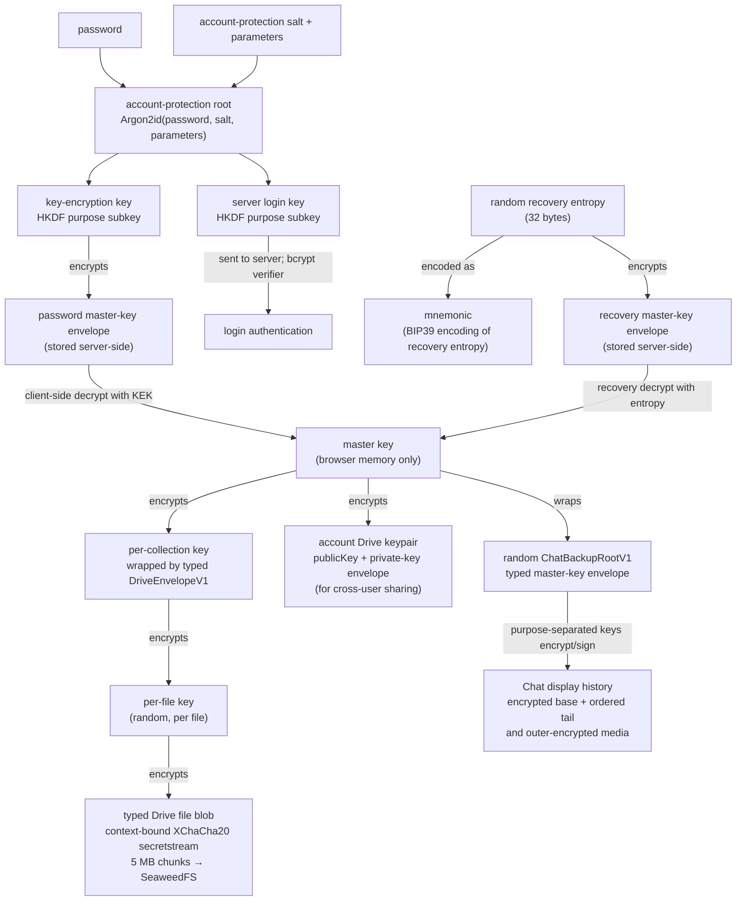
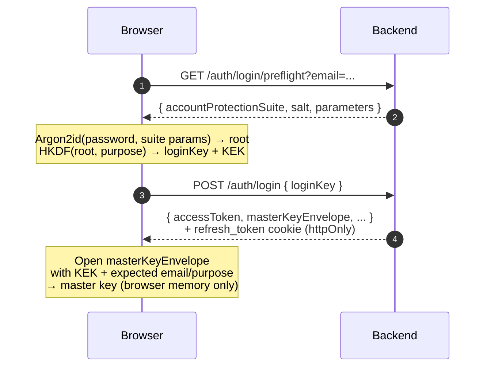
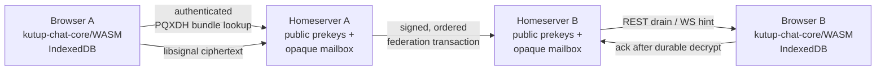
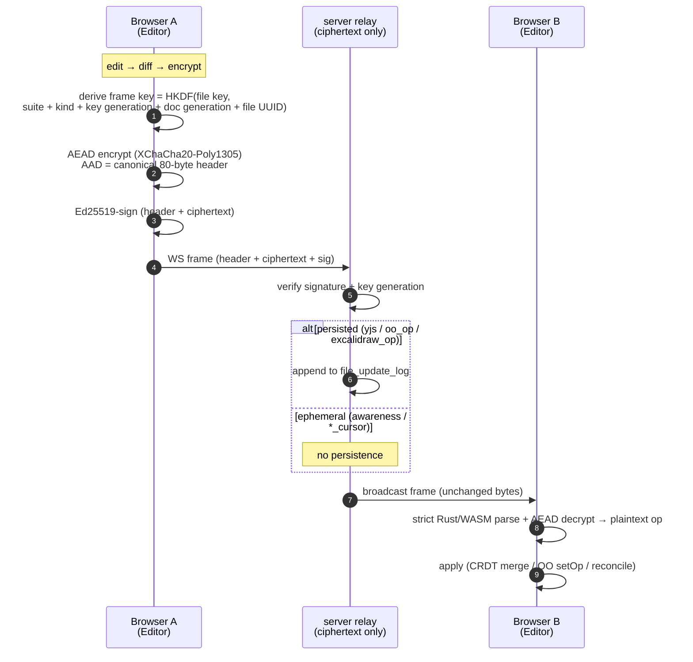

# Architecture

Kutup is an end-to-end encrypted Drive, collaboration, and Chat system. Servers
store protected content as ciphertext and never receive its plaintext keys.
They still process the account, routing, timing, size, quota, and federation
metadata required to operate the service; the individual protocol threat models
state the exact residual metadata.

Kutup-owned cryptographic protocols follow the purpose-specific suite,
authenticated-capability, policy-floor, suite-locking, and explicit-migration
rules in [`crypto-agility.md`](crypto-agility.md). That decision is authoritative
for protocol evolution. This document describes the V1 target; unfinished
pre-tag cutovers are listed explicitly in [`roadmap.md`](roadmap.md) and must
not be advertised as complete.

Chat and Drive federation share the versioned identity, discovery, and HTTP
authentication boundary specified in
[`federation-protocol.md`](federation-protocol.md). Its pure v2 protocol and
identity/trust/policy persistence are implemented and both feature protocols
are cut over. No mixed v1/v2 trust path or raw remote URL remains.

---

## Key Hierarchy


```mermaid
flowchart TD
    P["password"]
    APS["account-protection salt + parameters"]
    APR["account-protection root<br/>Argon2id(password, salt, parameters)"]
    KEK["key-encryption key<br/>HKDF purpose subkey"]
    LK["server login key<br/>HKDF purpose subkey"]
    RE["random recovery entropy<br/>(32 bytes)"]
    M["mnemonic<br/>(BIP39 encoding of recovery entropy)"]
    EMK["password master-key envelope<br/>(stored server-side)"]
    ERK["recovery master-key envelope<br/>(stored server-side)"]
    MK["master key<br/>(browser memory only)"]
    CK["per-collection key<br/>wrapped by typed DriveEnvelopeV1"]
    DRIVE["account Drive keypair<br/>publicKey + private-key envelope<br/>(for cross-user sharing)"]
    CBR["random ChatBackupRootV1<br/>typed master-key envelope"]
    CBO["Chat display history<br/>encrypted base + ordered tail<br/>and outer-encrypted media"]
    FK["per-file key<br/>(random, per file)"]
    BLOB["typed Drive file blob<br/>context-bound XChaCha20 secretstream<br/>5 MB chunks → SeaweedFS"]

    P --> APR
    APS --> APR
    APR --> KEK
    APR --> LK
    LK -->|sent to server; bcrypt verifier| AUTH["login authentication"]
    RE -->|encoded as| M
    KEK -->|encrypts| EMK
    RE -->|encrypts| ERK
    EMK -->|client-side decrypt with KEK| MK
    ERK -->|recovery decrypt with entropy| MK
    MK -->|encrypts| CK
    MK -->|encrypts| DRIVE
    MK -->|wraps| CBR
    CBR -->|purpose-separated keys encrypt/sign| CBO
    CK -->|encrypts| FK
    FK -->|encrypts| BLOB
```

Mail address keys are random OpenPGP keys (rPGP), one or more per email
address, each sealed in an `AccountEnvelopeV1` under the master key. Each
address publishes a signed key list (`MailKeyListV1`) signed by the account
authority, so the pin a contact holds for the account covers its mail keys
([`plans/mail-address-keys.md`](plans/mail-address-keys.md)).

The canonical implementation is `kutup-crypto` (`dryoc` plus RustCrypto). The
browser consumes it through WASM; CLI and native clients call the same Rust
implementation. A primitive-only browser adapter is allowed solely under the
10×/platform-failure exception in
[`cryptographic-dependencies.md`](cryptographic-dependencies.md). The backend
remains a ciphertext relay.

---

## Registration Flow

1. Client generates a random 32-byte **master key**.
2. Client derives one account-protection root with the persisted suite,
   Argon2id salt and parameters. Domain-separated HKDF expands that root into a
   **key-encryption key** and a **login key**. Only the base64-encoded login key
   is sent to the server, which bcrypts it into `login_key_hash`. The password,
   root and key-encryption key never leave the client.
3. Client derives the account authority, incarnation, Drive X25519 keypair and
   Drive Ed25519 share-signing key from the master key under independent fixed
   HKDF labels. Their public values are bound to the account at registration
   and later published unchanged in the signed account manifest; private keys
   are never sent in plaintext.
4. Client generates 32 random bytes of **recovery entropy** and encodes those
   exact bytes as a 24-word BIP39 mnemonic. BIP39 is an encoding here; the
   recovery path does not run Argon2id.
5. The canonical Rust implementation creates three XChaCha20-Poly1305
   `AccountEnvelopeV1` values:
   - `masterKey` under the key-encryption key with purpose `PasswordMasterKey`;
   - `masterKey` under the recovery entropy with purpose `RecoveryMasterKey`;
   - the Drive private key under the master key with purpose
     `DriveHpkePrivateKey`.
   Each single envelope carries and authenticates its closed suite ID, typed
   purpose, canonical lowercase login email, 24-byte nonce and exact ciphertext
   length. Separate nonce columns and implicit account-wrap formats do not
   exist in V1.
6. Client also derives a **recovery authorization proof** with HKDF-SHA256 from
   the recovery entropy, the fixed purpose
   `kutup/account-recovery/auth-proof/v1`, and the canonical lowercase login
   email.
   The server bcrypts only that proof into `recovery_key_verifier`. The proof is
   password-equivalent for recovery authorization, but cannot decrypt
   `recoveryKeyEnvelope`; the raw recovery entropy never leaves the client.
7. Client POSTs the encrypted bundle to `POST /api/auth/register`. The server
   stores all ciphertext, the complete public account-identity binding, and the
   recovery verifier. The mnemonic is shown to the user once and never stored
   anywhere. Every later account manifest must match the registered authority,
   incarnation, Drive encryption key and Drive signing key exactly.

---

## Login Flow


```mermaid
sequenceDiagram
    autonumber
    participant B as Browser
    participant S as Backend

    B->>S: GET /auth/login/preflight?email=...
    S-->>B: { accountProtectionSuite, salt, parameters }
    Note over B: Argon2id(password, suite params) → root<br/>HKDF(root, purpose) → loginKey + KEK
    B->>S: POST /auth/login { loginKey }
    S-->>B: { accessToken, masterKeyEnvelope, ... }<br/>+ refresh_token cookie (httpOnly)
    Note over B: Open masterKeyEnvelope<br/>with KEK + expected email/purpose<br/>→ master key (browser memory only)
```

1. Client fetches `GET /api/auth/login/preflight?email=...` to retrieve the
   account-protection suite, salt and complete Argon2id parameters.
2. Client recomputes one root via Argon2id in a Web Worker, then derives the
   login key and key-encryption key with distinct fixed HKDF purposes.
3. Client POSTs the base64 `loginKey` to `POST /api/auth/login`. Server bcrypt-compares it against the stored `login_key_hash`.
4. On success the server returns an **access token** (short-lived JWT) in the JSON body and sets the **refresh token** as an HTTP-only `refresh_token` cookie scoped to `/api/auth/refresh`.
5. The login response carries `masterKeyEnvelope` and
   `drivePrivateKeyEnvelope`; the client opens them locally with the expected
   account and purpose bindings. The server-facing login key cannot decrypt
   either. The master key lives only in client memory.
6. If 2FA is enabled, the server returns `{requiresTotp: true, preAuthToken: ...}` instead of full tokens. The client completes login at `POST /api/auth/login/2fa` with a TOTP code before receiving the full JWT.
7. For accounts created via `ADMIN_ACCOUNT` that have not yet generated a recovery phrase, the server returns `{requiresSetup: true, setupToken: ...}`. The client derives a fresh key bundle and submits it to `POST /api/auth/complete-setup`.

---

## File Encryption

For each file upload:

1. Client generates the canonical file UUID and random **file key** before contacting the server.
2. Client constructs a 32-byte `DriveFileBlobHeaderV1` containing magic,
   `DriveObjectSuiteId`, file-blob purpose, the file key's generation (1 for
   a new file) and the file UUID — no folder, so the file can move without
   re-encryption. HKDF-SHA256 derives a stream key from the random file key
   and that exact header.
3. Client encrypts the bytes in 5 MiB XChaCha20 secretstream frames. The Drive
   header is associated data on every frame, and even an empty object emits an
   authenticated `TAG_FINAL` frame. The stored prefix is the 32-byte Drive
   header followed by the 24-byte secretstream header.
4. Client seals `{name, mimeType, size}` as a `FileMetadata`
   `DriveEnvelopeV1` under the file key. Its authenticated context binds the
   file UUID, the key generation and the metadata revision.
5. Client seals the file key as a `FileKey` `DriveEnvelopeV1` under the
   collection key, bound to the file, the collection, the collection epoch
   and the key generation. This wrap is the only file object that names the
   folder: moving a file re-seals it for the destination and nothing else
   (docs/plans/drive-move.md).
6. Client uploads the UUID, two canonical envelopes, and opaque content. The
   backend independently checks all three public headers against the current
   collection epoch and the file's key generation before storage. Multipart,
   tus, version snapshots and signed federation use identical blob semantics.
7. Rename creates the exact next metadata revision; rollback, gaps, relocation,
   wrong purpose, stale epoch or generation, stream truncation and bytes
   after `TAG_FINAL` fail closed.
8. A file whose folder rotated past it (someone was removed) gets a new key
   of the next generation before anything new is written to it or it moves;
   the key it leaves is sealed under the new one, so older content, versions
   and thumbnails still open through the file's own key chain.

On download, the client receives the blob and all encrypted fields, then reverses the process locally.

**Names in a folder** (docs/plans/drive-unique-names.md). A name is unique
among a folder's files and subfolders, and among an account's top-level
folders, compared without letter case or Unicode composition. The server
keeps it so without reading a name: every write that names something sends
the name's HMAC under the place's hash key (HKDF of the folder's first,
epoch-1 key, which every member reaches through the key chain and which
no rotation changes; the account master key for the top level), and unique
indexes plus a per-place advisory lock refuse a second item with the same
hash (`409 name_taken`, naming what holds it). Each upload also hashes the
plaintext (SHA-256, read while it encrypts) and records a content hash
under the same key, so a client about to upload a file with a taken name
and the same size can tell whether it is the same file: then nothing is
sent ("Already in this folder"); otherwise the person chooses Replace (the
file there goes to the trash), Keep both (`name (2)`) or Skip. Items made
before this, or by a client that sends no hash, are filled in by the
owner's client when it opens the folder, the later of two duplicates
renamed `name (2)`.

---

## Collection Sharing

Sharing a collection with another user uses the recipient's account-manifest-bound
Drive HPKE key and the owner's manifest-bound Drive signing key. A
`NamedShareEnvelopeV1` authenticates the owner, recipient, collection, epoch,
canonical accounts, and both account incarnations. Local and federated sharing
use the same cryptographic envelope; federation adds only signed routing and a
domain-bound delivery capability. The server stores the envelope but cannot
open the collection key.

A single file can also be shared by itself (docs/plans/drive-file-sharing.md).
A `FileShareEnvelopeV1`, sealed and signed the same way, carries that file's
own key, bound to the file and its key generation. The recipient never gets
the folder's key. Removing someone moves the file to a new key, re-sealed for
whoever stays. When the file moves to a new key another way (a folder member
re-keys it after the folder rotated), its shares can read what they had but
cannot edit. The owner's Drive re-seals them the next time it is open.

People who share a folder also give each other their profile key, in a
`ProfileKeyEnvelopeV1` sealed and signed the same way, so Drive shows names
and pictures from the end-to-end encrypted profile. The server accepts one
only between people with a share between them, forwards it to the other
person's server when needed, and cannot read it
(docs/plans/unified-profile.md).

Public links use the same typed envelope implementation with the distinct
`PublicLinkCollectionKey` purpose. The random link key stays exclusively in
the URL fragment. The server validates the envelope's public header against
the owned collection, owner account and current epoch before storing it, but
cannot open it. A V1 public link targets one collection; it is never treated as
a named-user or federated identity grant.

---

## Federation Model

Federation allows sharing a collection with a user on a **different Kutup
server**. Drive and Chat are feature adapters over one server identity,
discovery, peer pin, admission policy, replay store, and signed transport.
Drive's capability grants access to one encrypted share; it does not replace
server authentication.

```
Server A (sharer)                          Server B (recipient)
─────────────────                          ────────────────────
1. Resolve and pin b.example
   via signed v2 discovery

2. Signed Drive directory lookup
   GET /api/fed/drive/users/bob
                                           ← signed bob@b.example publicKey

3. Browser seals collection key to Bob
   POST /api/collections/:id/federated-shares
   (stores canonical b.example + capability hash)

4. Return /invite#server=a.example&capability=...
   (fragment keeps capability out of HTTP requests/logs)

                                           5. Recipient opens invite link
                                              POST /api/drive/federation/shares
                                              Server B fetches signed invite
                                              and checks intended username

                                           6. Recipient browses local proxy API
                                              Server B sends signed drive.v1
                                              requests plus the separate share
                                              capability to Server A

                                           7. Download is spooled and its signed
                                              ciphertext digest verified before
                                              bytes reach the browser.
```

Production federation accepts canonical DNS identities and public HTTPS only.
The shared resolver verifies signed endpoint delegation, pins the peer
identity, resolves and connects to the already-validated address set, disables
redirects, and rejects private/loopback/link-local destinations. Plain HTTP and
private networks are available only to the explicit isolated test harness.

**Cross-server upload/delete** is gated by the `canUpload` and `canDelete`
grants. Mutations are idempotent under stable request IDs; changing the signed
content under an existing ID is rejected.

---

## Federated E2EE Chat ("ileti")

Chat is a separate cryptographic subsystem from drive encryption and
collaborative editing. It uses the shared Rust `kutup-chat-core` engine in the
browser through WebAssembly; the work-in-progress Android and iOS clients are
integrating the same engine through UniFFI. Those native apps are not yet
release-ready. The normative contract is
[`chat-protocol.md`](chat-protocol.md).


```mermaid
flowchart LR
    A["Browser A<br/>kutup-chat-core/WASM<br/>IndexedDB"]
    HA["Homeserver A<br/>public prekeys +<br/>opaque mailbox"]
    HB["Homeserver B<br/>public prekeys +<br/>opaque mailbox"]
    B["Browser B<br/>kutup-chat-core/WASM<br/>IndexedDB"]

    A -->|"authenticated<br/>PQXDH bundle lookup"| HA
    A -->|"libsignal ciphertext"| HA
    HA -->|"signed, ordered<br/>federation transaction"| HB
    HB -->|"REST drain / WS hint"| B
    B -->|"ack after durable decrypt"| HB
```

### Client and server responsibilities

- Each chat device has an independent libsignal identity and publishes signed
  prekeys plus one-time classical and post-quantum prekeys. New sessions use
  PQXDH; established sessions use libsignal's Triple Ratchet construction.
- A logical send encrypts separately to every active recipient device. A
  server-side device-set mismatch rejects the entire send, causing the client
  to refresh the signed directory and re-encrypt instead of silently skipping
  a device.
- The client persists ratchets, plaintext history, pending ciphertext,
  message-request state, encrypted-profile capabilities, and account-identity
  pins in an account-scoped IndexedDB database, encrypted at rest under a key
  wrapped by the account master key and committed with strict durability. Web Locks serialize ratchet transactions across tabs; a tab
  that freezes holding the lock is taken over, and a writer generation fences
  its late writes (`docs/chat-protocol.md`, "Browser storage"). Ciphertext is durably journaled before decrypt and
  acknowledged only after the ratchet advance and plaintext commit together.
- The server stores public directory material and opaque per-device mailbox
  ciphertext. REST drain/ack is the source of truth; a one-use-ticket WebSocket
  is only a low-latency reconciliation hint. Client-generated `sendId` values
  make retries idempotent.
- Note to Self is a self-addressed direct conversation. On multi-device
  accounts, encrypted sent transcripts synchronize messages to the sender's
  other devices; a one-device note remains local without creating a fake
  one-member group.

### Continuous display-history backup

Every durable display mutation enters a crash-safe local backup outbox and is
uploaded to the account homeserver as an opaque ordered segment. Clients
periodically compact verified history into one encrypted base and atomically
CAS a signed restore-point manifest. Eligible media is independently
outer-encrypted and restored lazily. The account homeserver can order, quota,
retain, and delete these objects but cannot read the archive.

After unified account recovery, a clean browser verifies and restores the
latest base plus complete tail. It does not restore device keys, libsignal
ratchets, MLS epochs, mailbox cursors, receipts, or pending outboxes, and it
does not contact another installation for history. The current contract and
threat model are [`chat-backup.md`](chat-backup.md) and
[`chat-backup-security-threat-model.md`](chat-backup-security-threat-model.md).

### Identity, contacts, and profiles

The stable chat address is `username@server`; no alias namespace exists.
Changeable, non-unique display names and avatars are encrypted profile data and
never routing identities. Profile keys are capability-distributed inside E2EE
messages. Incoming strangers begin as durable message requests. Accept,
reject, block, and unblock are client-held relationship state; blocking also
rotates the local encrypted-profile capability so the blocked peer cannot read
future profile versions.

Encrypted profile fields use `ProfileSuiteId = 1` and canonical
`ProfileEnvelopeV1` XChaCha envelopes. HKDF separates display-name, avatar and
master-key-wrapped profile-key purposes; the authenticated context binds the
canonical owner, version, revision and source device. The encrypted E2EE
profile-key capability carries the matching suite code, so a future or missing
suite cannot be silently interpreted as V1.

Accepted contacts use sealed sender when both servers advertise a complete
authenticated service policy. The destination receives only an origin domain,
recipient, capability, send id, and opaque per-device envelopes; mailbox rows
do not contain the sender. First contact, Note to Self, and linked-device sync
remain identified. Blocking rotates the profile key and delivery capability
before redistributing the new key to remaining contacts.

### Account identity, device directory, and verification

One stable `AccountSelfAuthorityV1` signs the complete
`AccountManifestV1`. The manifest binds account-scoped Drive keys and every
active device record (maximum ten), and carries a monotonic sequence plus the
previous-manifest hash. Clients fetch every missing complete manifest, verify
exact continuity and commit the chain and peer pin atomically. Missing,
duplicated, reordered, rolled-back, same-sequence-conflicting, malformed or
invalidly signed history blocks new sensitive operations while retaining
existing ciphertext.

First contact is TOFU and displays a gray shield. A face-to-face QR comparison
pins the account authority and incarnation across Drive, Direct Chat, groups
and channels and displays a green verified shield. An unexpected authority or
incarnation change displays red and quarantines new sends/shares until the user
explicitly accepts a safety-number-style reset. The server can relay manifest
history but cannot promote trust. V1 has no global transparency log, sparse
map, checkpoint/proof policy, monitor, witness or auditor.

### Transport-only federation

Federation uses canonical DNS server names, `.well-known` delegation, and
destination/body-bound Ed25519 request signatures. Outbound transactions are
persisted and strictly ordered per destination; receivers atomically commit
mailbox rows, replay records, and a contiguous sequence high-water mark.
Neither homeserver replicates conversation or room state.

The common stack is defined by
[`federation-protocol.md`](federation-protocol.md): hash-linked server identity
rotation, signed endpoint/capability discovery, and a strict RFC 9421/9530
request-and-response profile shared by Chat and Drive. It owns DNS/SSRF-safe
resolution, discovery caching, immutable TOFU/verified/quarantined identity
history, admission policy, signed transport, and replay reservation. Chat is a
feature adapter above that stack and owns only its E2EE directory, profile, and
ordered ciphertext-delivery payloads. Drive uses the same transport while
retaining separate domain-bound share capabilities and mutation idempotency.

Federation is disabled unless the administrator configures a persistent
signing key. A database-backed admission policy then selects `disabled`,
`allowlist`, `blocklist`, or `open`. Directional per-domain actions are
`inherit`, `allow`, or `block`: allowlist denies inherited directions,
blocklist allows them, open deliberately ignores saved rules, and disabled
denies everything and hides discovery/capability advertisement. Rules survive
mode changes. Policy is enforced before outbound discovery/queuing and before
an inbound request can trigger origin discovery; admitted requests must still
pass HTTPS, DNS/SSRF, protocol, signature, payload, and rate-limit checks.

Every admitted first contact is cryptographically validated before it becomes
a persistent TOFU pin. Administrators may raise a feature or domain to verified
trust, compare the full key fingerprint out of band, retry discovery, and use a
tightly confirmed, audited break-glass re-pin only for a quarantined competing
history. Valid old-and-new-key-signed rotations advance automatically;
rollback, gaps, silent replacement, and downgrade are rejected.

The desktop-width and mobile-width web admin layouts render the same generic operational
projection: shared peer trust plus feature diagnostics, server/fingerprint
filters, retry-one/retry-visible workflows, immutable identity evidence, and a
filtered federation audit feed with CSV export. These are read-only views over
the common trust, policy, replay, Chat outbox, and Drive share tables. They do
not create a feature-owned identity, cache, client, or admission path.

### Current product boundary

The web client supports Direct Chat, linked-device synchronization, Note to
Self, transport federation, message requests/blocking, encrypted profiles,
sealed sender, MLS private groups, encrypted attachments, replies, reactions,
edits/deletions, delivery/read state, typing, disappearing messages, local
search, camera/voice capture, and continuous encrypted history/media recovery.
Confidential broadcast, calls, push delivery, and native-client product
integration remain tracked in [`roadmap.md`](roadmap.md).

---

## Storage Layer

Files are stored in **SeaweedFS** accessed via its S3-compatible API. The backend uses the Rust `aws-sdk-s3` crate configured to point at the internal SeaweedFS S3 gateway.

- The backend acts as a **streaming proxy** — multipart uploads are spooled to a temp file and streamed to the object store; the tus.io path stores each chunk as S3 multipart parts of one equal size (5 MiB, more for uploads past 10,000 parts), keeping what does not fill a part in the upload's row until the next chunk, so neither buffers the whole file in memory and stores that refuse unequal parts (Cloudflare R2) work.
- **Uploads from the browser survive a lost connection and a reload.** The web client encrypts a file 5 MiB at a time as tus asks for each range (`frontend/packages/files/src/upload/encryptedSource.ts`), so memory stays at about two chunks whatever the size. A connection lost for any length of time leaves the upload waiting ("Waiting for the connection"); it goes on from the server's offset (tus `HEAD`) once the browser is back online. Drive and Photos also remember each upload in IndexedDB (`pendingUploads.ts`: the tus URL, size and modified time, the folder and its key epoch, the two envelopes the upload already made, and the public prefix: nothing readable without the folder key). After a reload or a crash the upload panel offers it again; choosing the same file (same name, size and modified time) goes on where the server stopped. The encryptor is rebuilt from the stored prefix (libsodium sets a stream up the same way for pushing as for pulling), and what the server already holds is re-encrypted and dropped, not sent; nothing in the format changes. An upload running in some tab holds a Web Lock, so it is never offered as interrupted. One idle for 24 hours is reaped by the server and dropped from the list; one whose folder moved to a new key since cannot go on and is offered only to discard.
- Each file is stored under its client-generated UUID; the human-readable name exists only in its authenticated metadata envelope, which the server cannot read. Its keyed name and content hashes ("Names in a folder" above) tell the server only which items in one folder share a name or content.
- The SeaweedFS cluster (master + volume + filer + S3 gateway) runs as Docker services on the same network as the backend. No S3 ports are exposed externally.
- Each account has one storage pool (`users.storage_quota_bytes` /
  `storage_used_bytes`, 10 GiB default, administrator-controlled per account).
  Drive, Photos, Office, Maps and Chat (delivery media, history segments and
  bases, protected history media) all charge it. Every write locks the user row
  (`storage_pool::lock`) and checks used + reserved + new bytes against the
  quota; reserved bytes are open tus uploads, open Chat media uploads, and
  pending federated inbound Chat-media hand-overs. Each stored copy counts
  separately. `quota_reconcile_tick` rewrites the counter from the rows.
  `GET /api/user/storage` returns the breakdown that the Account app's
  Settings → Storage page shows.

---

## Database

PostgreSQL 16 is used for all persistent metadata:

- User accounts, key bundles, public keys
- Collection records and sharing permissions
- File records (encrypted metadata, SeaweedFS object keys)
- Public share tokens
- Federation share tokens and incoming shares
- Chat devices and public prekey pools
- Opaque per-device chat mailboxes and idempotent send records
- Account-local Chat backup authorization, signed manifests, ordered opaque
  segments, base/media object references, and reconciliation/staging state,
  charged to the account storage pool
- Account manifests, complete signed manifest history, and durable peer pins
- Unified federation local/peer identity history, trust/quarantine evidence,
  replay reservations, and feature-scoped policy
- Durable per-destination federation outboxes and inbound replay/high-water records
- TOTP secrets (encrypted)
- Global settings and per-user quotas

Migrations live in `crates/kutup-server/migrations/` (sqlx's reversible `.up/.down.sql` format), are embedded into the server binary at compile time via `sqlx::migrate!()`, and run automatically on startup.

## Collaborative Editing

kutup supports real-time, end-to-end-encrypted collaborative editing for three file families:

| Family | Extensions | Engine |
|---|---|---|
| Notes / code | `.md`, `.txt`, `.js`, `.ts`, `.go`, `.py`, `.cpp`, `.rs`, … | Yjs CRDT (`Y.Text`) under CodeMirror 6 with `y-codemirror.next` |
| Office | `.docx`, `.xlsx`, `.pptx` | OnlyOffice client-side via the CryptPad pattern (`OO_OP` envelope kind wraps OnlyOffice's native ops; see [`docs/onlyoffice.md`](onlyoffice.md)) |
| Whiteboards | `.excalidraw` | Excalidraw with last-write-wins per element via `versionNonce` + `reconcileElements` |

The architecture is summarised below; the design rationale and footguns live in `docs/superpowers/specs/2026-05-04-collab-edit-design.md`.


```mermaid
sequenceDiagram
    autonumber
    participant A as Browser A<br/>(Editor)
    participant R as server relay<br/>(ciphertext only)
    participant B as Browser B<br/>(Editor)

    Note over A: edit → diff → encrypt
    A->>A: derive frame key = HKDF(file key,<br/>suite + kind + key generation + doc generation + file UUID)
    A->>A: AEAD encrypt (XChaCha20-Poly1305)<br/>AAD = canonical 80-byte header
    A->>A: Ed25519-sign (header + ciphertext)
    A->>R: WS frame (header + ciphertext + sig)
    R->>R: verify signature + key generation
    alt persisted (yjs / oo_op / excalidraw_op)
        R->>R: append to file_update_log
    else ephemeral (awareness / *_cursor)
        Note over R: no persistence
    end
    R->>B: broadcast frame (unchanged bytes)
    B->>B: strict Rust/WASM parse + AEAD decrypt → plaintext op
    B->>B: apply (CRDT merge / OO setOp / reconcile)
```

### Sync engine
Three engines run side-by-side, each routed by `KIND` byte in the envelope:
- **Yjs CRDT** (`KIND.YJS_UPDATE` = 1) for notes/code. Clients exchange opaque binary update frames; the server never instantiates a `Y.Doc`.
- **OnlyOffice op** (`KIND.OO_OP` = 4) wraps the editor's native operation stream. Keeps document state consistent across peers using OO's own coauthoring protocol — patched to run client-side per [`docs/onlyoffice.md`](onlyoffice.md).
- **Excalidraw op** (`KIND.EXCALIDRAW_OP` = 8) carries an array of changed elements. Convergence relies on each element's `versionNonce` plus Excalidraw's `reconcileElements` — last-write-wins per element, no CRDT semantics. Ephemeral on the wire (canonical state lives in snapshots).

### Wire envelope
`CollabFrameSuiteId = 1` is encoded as a canonical 80-byte big-endian header,
XChaCha20-Poly1305 ciphertext/tag and a trailing 64-byte Ed25519 signature. The
header authenticates suite, kind, file-key generation, document-key
generation, file UUID, sender device, sequence, nonce and exact ciphertext
length. The server strictly parses the same Rust format, verifies
the registered sender signature, requires the exact current context and stores
only the opaque bytes.

### Collaboration frame key
The canonical Rust implementation derives a purpose key with HKDF-SHA256 from
the file key. Suite, kind, file-key generation, document-key generation and
file UUID are derivation inputs and header AAD. A key or frame cannot be
relocated to another document, key generation, document generation or kind;
it names no folder, so a document's log survives a move. Browser clients call this implementation through
WASM; CLI/native clients call the same crate directly.

### Device keys
Each browser tab session and each CLI session generates a fresh Ed25519 keypair. The public key is registered to the user account; the private key never leaves the device. Revocation marks the device inactive and forces existing WebSocket connections to close.

### Versioning
Two-tier:
- **Live deltas** in Postgres `file_update_log` (truncated on snapshot).
- **Snapshots** as SeaweedFS S3 noncurrent versions, indexed in `file_versions`.

Snapshots fire on idle 30s + ≥1 update, every 200 updates, or on explicit "Save version".

Retention: 30 days OR last 50 versions, whichever yields more. Named/keep-forever versions are exempt forever.

Versions are stored with one request (`POST /files/:fileId/versions`, multipart, charged by measured size, one object per version; `docs/plans/drive-versions-v2.md`) and are file-type-agnostic — notes (`kind = yjs`), office docs and whiteboards (`kind = file`) all use the same plumbing. Restore for blob-based editors (office, whiteboard) reposts the chosen old bytes as a new version then reloads the page; for Yjs editors the CRDT merges the restored state in-place.

### Federation, sharing
A live-edited file is still a regular `files` row with an encrypted blob; non-editing users download it as usual.

Across servers, each browser connects only to its own server. For a file on another server, that server (the bridge) keeps a local room, subscribes at the file's server (home) over the signed Drive federation transport, sends its users' frames home in batches, and receives home's new frames by push, never by polling. Home applies the same checks as for a local frame plus the share's edit permission, and stores remote senders as `(domain, device)`. Versions and the seed are relayed the same way. Only notes and place lists use it so far; see `docs/plans/collab-federation.md`.

### Replay protection
Each frame carries a per-device monotonically-increasing sequence number. The `file_update_log` has a `UNIQUE (file_id, sender_device, sender_seq)` constraint that rejects replays at the database level. Combined with Ed25519 signature verification on every frame, this prevents both forgery and replay attacks.

### File editor route + cross-tab session
A file opens full screen at `/file/:cid/:fid` (`/shared/file/:fid` for a file shared by itself). The page is one shared package, `@kutup/editors` (`frontend/packages/editors`), mounted by both Drive and Office; it opens the folder and file keys, then the editor or viewer the file needs (the collaborative text editor, OnlyOffice in the `editor.` sandbox, Excalidraw, or an image, PDF or media viewer).

Each file has **one address**, whichever app it is opened from (`appFor` in `packages/editors/src/paths.ts`):

- **Office** (`office.<domain>`) opens what is edited: notes and code, `.docx`/`.xlsx`/`.pptx`, PDFs (in OnlyOffice's PDF editor, or the viewer when the file is read-only or on another server) and whiteboards.
- **Maps** opens place lists (`.kutupmap`).
- **Drive** opens everything else: photos, videos, audio and other files.

Drive's lists, search and New menu link a document straight to Office (`?from=drive`, so its back button returns to the folder); the Office home opens it in place. A file opened in the other app (an older `drive.<domain>/file/…` link, say) is replaced by its address in the right one, keeping `?from=`. The back button goes to the app named in `from` (only `drive` or `office` are honoured), or else to Office's home or the file's Drive folder. Only Office may frame the OnlyOffice sandbox (its `frame-ancestors`, and Office's `frame-src`; `frontend/docker/40-kutup-hosts.sh`).

Public links follow the same rule. A link to one document is `office.<domain>/s/<token>#key=…`; a folder's link is `drive.<domain>/s/<token>#key=…`, whose documents open at `office.<domain>/s/<token>/<fileId>#key=…` (the key goes along in the fragment, never through a server) with a way back to the folder. Office shows the document as it is now and read-only, without an account (`packages/editors/src/public/`): OnlyOffice in its viewer with no session or live-editing socket, notes rendered with their pictures (`GET /api/share/:token/files/:fileId/assets/:assetId`), code read-only, whiteboards in Excalidraw's view mode, PDFs in the browser's viewer. A Drive link to one document, made before, is replaced by its Office address. Every public page (Drive, Office, Photos) says who shared it (`ownerAccount`) and that nobody checked what is in it: the pages are on the server's own address, so a link must not pass off what someone put in it (a sign-in form, a payment request) as the server's.

Anyone who opens a public link can report it (`POST /api/share/:token/report`, no account, rate-limited per address, nothing about the reporter kept). The server cannot see what a link shows, so the reporter may include the whole link, key in the fragment, for an administrator to open; the server accepts only one of its own public pages for that token, and erases the link once the report is resolved. Administrators work through reports in the account app (Admin → Reports): dismiss one, take the link down, or disable the account that made it. A link that is taken down, or whose owner's account is disabled, answers `410` with `code: "link_removed"` on every request, and its pages say it was removed; enabling the account again restores its links that were not taken down. Each action is in the admin activity log.

Sensitive material is held tab-locally (Redux + `sessionStorage`). To avoid forcing a fresh login when a new editor tab opens, an already-authenticated tab broadcasts its session payload over a same-origin `BroadcastChannel('kutup-session')`. The fresh tab requests the session on boot (500 ms timeout); on hit it dispatches `setAuth`, on miss it redirects to `/login?next=<path>`. Logout is also broadcast — every tab signs out together so a sibling tab can't re-hydrate a fresh tab after sign-out. See `frontend/src/lib/sessionSync.ts`.
