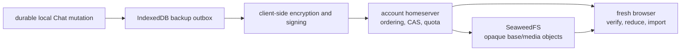

# Continuous E2EE Chat backup

**Status:** implemented and required-PR-gated as of 2026-08-14; the
default-branch stability observation remains in progress

This document describes Kutup's current Chat-history protection and
fresh-browser restore behavior. The HTTP operations are listed in
[`api.md`](api.md#chat-e2ee-messaging), the cryptographic formats are inventoried
in [`v1-format-inventory.md`](v1-format-inventory.md), and the security analysis
is [`chat-backup-security-threat-model.md`](chat-backup-security-threat-model.md).
The original detailed design remains in
[`plans/continuous-e2ee-chat-backup.md`](plans/continuous-e2ee-chat-backup.md) as
an implementation record.

## Product contract

- Chat history protection is automatically provisioned after the existing
  account recovery setup. It uses the random account master key and the same
  24-word recovery path as Drive; there is no separate backup code.
- Protection is always on. V1 has no disable switch, backup DELETE endpoint,
  downloadable archive, version browser, or selective restore.
- A new or cleared browser restores the latest valid server-acknowledged
  display history automatically after account unlock. A valid restore is never
  replaced by a silent empty history.
- The Chat settings surface reports **Latest protected**, pending work, and the
  states **Starting**, **Backing up**, **Offline**, **Media pending**,
  **Backup needs attention**, and **Protected**.
- Backup is display history, not transport state. It never restores a Chat
  device identity, libsignal ratchet/session, MLS epoch, mailbox cursor,
  receipt outbox, federation outbox, draft, typing state, or pending send. The
  replacement installation establishes fresh Direct and MLS state.
- Device-to-device history transfer is removed and unsupported. Missing,
  corrupt, rolled-back, or otherwise invalid backup state enters the explicit
  history-loss flow; another installation is never offered as a source.

## Trust and storage boundary

The account homeserver stores a typed wrapped backup root, public signer
authorization, signed manifest, ordered opaque event segments, one committed
opaque base, separately outer-encrypted history-media objects, idempotency
records, cursors, digests, lengths, quota counters, and staging/reconciliation
state. It cannot decrypt conversation IDs, participants, messages, reactions,
filenames, MIME types, expiry controls, previews, or media.

Backups are account-local. Federated Direct or MLS messages enter each
participant's archive only through that participant's client and are stored
only by that account's homeserver. Federation never copies one account's
backup to the peer server.

## Keys and formats

The client generates a random 32-byte `ChatBackupRootV1` and wraps it in
`AccountEnvelopeV1` with the dedicated Chat-backup-root purpose. Independent
HKDF-SHA256 subkeys cover:

- encrypted event segments;
- compacted base archives;
- opaque media identifiers;
- backup-media outer encryption; and
- manifest signing.

Contexts bind the canonical account, account incarnation, backup incarnation,
suite, and standard-Chat protection domain. Segment keys additionally bind the
source device, device sequence, operation ID, and predecessor digest. Media
keys bind the opaque media ID, source digest, padded length, and format.

V1 archives are canonical, bounded, and uncompressed. Unknown compression
wrappers, suites, purposes, domains, declared lengths, trailing bytes, missing
final tags, and noncanonical record sequences fail closed.

## Continuous append lifecycle

1. The Chat service commits a display mutation to its local account database.
2. The coordinator discovers that durable state and adds or coalesces the
   corresponding mutation in the IndexedDB outbox before any upload. A reload
   repeats discovery, so a crash between the Chat commit and backup scan does
   not require the old process to survive. A mutation is never considered
   protected merely because it was encrypted locally.
3. One serialized coordinator drains eligible work. It encrypts a bounded
   segment, preserving the stable record identity and deterministic mutation
   order, then appends it with a stable operation ID and per-device chain.
4. The homeserver validates the public format, active source device, exact
   sequence/predecessor, manifest binding, length, digest, idempotency, and
   quota before assigning the next account cursor.
5. Only the matching server acknowledgement removes the local pending entry and
   advances **Latest protected**. Ambiguous responses retry the same identity;
   changed content under an existing operation ID is a conflict.

Offline startup, reconnection, page hiding, the 64 KiB accumulation threshold,
and the normal debounce can all request a flush, but they share the same
serialized drain. A failed local acknowledgement leaves the exact operation
durably resumable after reload.

## Compaction and atomic restore points

Segments form the ordered tail. When thresholds are reached, a client:

1. restores and verifies the currently committed base plus complete tail in an
   isolated reducer;
2. builds a deterministic new base and exact protected-media reference set;
3. stages the opaque base object;
4. reconciles the media reference set in bounded pages; and
5. compare-and-swap commits a signed manifest against the exact previous
   generation, cursor, and digest.

The CAS transaction activates the staged base, switches media references,
removes the now-covered segment tail, and releases superseded quota. A crash at
verification, staging, reconciliation, CAS, or local pin persistence leaves
either the previous valid restore point or the committed replacement. Staged
objects expire after 24 hours.

Each installation pins the highest valid generation, covered cursor, and
manifest digest it has accepted. It rejects lower values, a conflicting digest,
a broken hash chain, unauthorized signing, or a cursor gap. A completely fresh
installation has no independent freshness pin; the residual rollback risk is
documented in the threat model.

## Fresh-browser restore

After the normal recovery flow unwraps the same account master key, the Chat
client:

1. provisions a new independent Chat installation and opens an empty local
   account store;
2. fetches the backup status and verifies the root envelope, signer
   authorization, manifest signature, account/incarnation/domain bindings, and
   rollback pin;
3. downloads and authenticates the committed base;
4. pages every segment after the covered cursor, requiring contiguous account
   cursors, unique operation IDs, and valid per-device digest chains;
5. applies canonical records in an isolated deterministic reducer; and
6. imports the verified result, persists its pin, and exposes the restored
   conversations.

Restore alone does not acknowledge a mailbox message, emit a delivery/read
receipt, or advance a mailbox cursor. New and overlapping live messages
deduplicate against stable backup record IDs. Deletes and expiry tombstones are
irreversible in reduction, so an older edit, reaction, or message cannot
resurrect removed content.

## Protected media

Eligible media receives a backup-specific opaque ID and padded outer
encryption. Normally the homeserver copies and outer-encrypts an existing
account-owned Chat-media ciphertext without learning its inner key or
plaintext. If the ordinary object is already gone but the encrypted source is
still in the client's private cache, the client can upload the verified outer
ciphertext directly.

Media is restored lazily when the user opens it. The client verifies the typed
header, exact digest and length, final authentication tag, source length, and
zero padding before making the inner Chat-media ciphertext available to the
normal decrypt/cache path. Missing or corrupt media produces an unavailable
item without invalidating verified text history.

Ordinary delivery media and history media are separate references. The
administrator's temporary-delivery retention defaults to 45 days and can be
disabled with zero; it never deletes a protected history-media object. Mailbox
ciphertext retention defaults to 30 days.

## Dedicated Chat quota and deletion

Chat has a dedicated per-account quota, separate from Drive/general storage.
The default is 2 GiB and administrators can change the default for new accounts
or an individual account. The single Chat meter includes:

- message-history segments and the committed base;
- ordinary retained delivery media; and
- protected history media.

At the boundary the server preserves enough logical headroom for deletion
tombstones and required compaction. Storage-full never silently evicts older
history. Pending message work remains in the local outbox; media-full can leave
media pending while message history continues. Lowering a quota below current
usage remains read-preserving and blocks new charged work. Increasing it lets
the same pending identities resume.

Message/media deletion becomes a durable tombstone and a later manifest CAS
releases the exact superseded bytes. Account deletion or an administrator
loss-recovery wipe removes every backup row, receipt/staging record, object
prefix, and charged Chat byte. Revoking one Chat device does not delete the
account backup.

## Required gates

The required CI workflow has four complementary levels:

- `Web, WASM, and frontend tests`: crypto/WASM vectors plus deterministic
  coordinator and real fake-IndexedDB tests;
- `Chat backup lifecycle (Postgres and SeaweedFS)`: live endpoint, retention,
  quota, reconciliation, concurrency, interruption, and purge coverage;
- `Clean-browser Chat backup recovery`: single-server automatic restore and
  protected/unavailable media behavior in a genuinely empty context; and
- `Two-server browser security`: Direct/MLS/media recovery for both accounts,
  account-local object proof, homeserver restart, and new post-restore sessions.

Playwright retries are zero. Sensitive jobs retain only allow-listed phase
names and aggregate counts; they disable raw traces, screenshots, videos, page
snapshots, and unsanitized logs. Exact local commands and artifact rules are in
[`../tests/e2e/README.md`](../tests/e2e/README.md).
